# Phishing Detection ML

[](https://github.com/Muneeraothman/phishing-detection-ml/actions/workflows/ci.yml)

An end-to-end machine learning system that classifies URLs as **phishing** or **legitimate**. Covers data cleaning, EDA, feature engineering from raw URL strings, training and comparing multiple models, rigorous evaluation, explainability, and deployment behind a FastAPI endpoint containerized with Docker, with automated tests and CI/CD.

This project exists to demonstrate traditional/classical ML engineering skill (feature engineering, model training and comparison, evaluation, explainability, productionization) as a complement to LLM/RAG-focused work, applied to a security-relevant problem.

**Scope (v1):** binary classification (phishing vs. legitimate) from the URL string alone. Explicitly out of scope for v1: email body/header/attachment analysis, deep learning/transformer/embedding-based text models, browser-extension or real-time threat-feed integration, and multi-class classification. These are noted as future work later in this README.

Status: ✅ complete (Phases 0-9). See [Future Work](#future-work) for the deliberately-out-of-scope stretch items.

## Table of Contents

- [Beginner's Guide: How This App & Machine Learning Work](#-beginners-guide-how-this-app--machine-learning-work)
  - [1. What This App Does (In Plain English)](#1-what-this-app-does-in-plain-english)
  - [2. How Machine Learning Works Here (No Prior ML Knowledge Needed)](#2-how-machine-learning-works-here-no-prior-ml-knowledge-needed)
  - [3. How the Web App Works (Even If You've Never Used Flask or FastAPI)](#3-how-the-web-app-works-even-if-youve-never-used-flask-or-fastapi)
  - [4. Step-by-Step Walkthrough: The Life of a URL Scan](#4-step-by-step-walkthrough-the-life-of-a-url-scan)
  - [5. Complete Guide: Where Every Important File and Folder Lives](#5-complete-guide-where-every-important-file-and-folder-lives)
- [Architecture](#architecture)
- [Dataset](#dataset)
- [Data Leakage Prevention](#data-leakage-prevention) _(added in Phase 1)_
- [EDA Findings](#eda-findings) _(added in Phase 2)_
- [Feature Engineering](#feature-engineering) _(added in Phase 3)_
- [Model Comparison](#model-comparison) _(added in Phase 4-5)_
- [Evaluation](#evaluation) _(added in Phase 5)_
- [Explainability](#explainability) _(added in Phase 6)_
- [Limitations](#limitations) _(added in Phase 6)_
- [Running the API Locally](#running-the-api-locally) _(added in Phase 7)_
- [Testing & CI/CD](#testing--cicd) _(added in Phase 8)_
- [Future Work](#future-work) _(added in Phase 9)_
- [Phase 10 / Live Deployment](#phase-10--live-deployment) _(attempted, paused)_
- [Report / Interview Prep](#report--interview-prep) _(added in Phase 9)_
- [Project Structure](#project-structure)

---

## 🚀 Beginner's Guide: How This App & Machine Learning Work

If you are new to Machine Learning (ML) or Python web frameworks like Flask and FastAPI, this section explains everything in plain English with everyday analogies.

---

### 1. What This App Does (In Plain English)

Imagine you receive an urgent email saying:

> _"Your bank account has been suspended! Click here immediately to verify your identity: `http://secure-login-bank-verification.xyz/auth`"_

If you click that link and enter your username and password, a cybercriminal steals your credentials. This attack is called **phishing**.

**What this application does:**
It is a **real-time security scanner**. You give it a link (URL), and in just **a few milliseconds**, it analyzes the address and tells you:

1. **The Verdict:** Is this link **`Legitimate`** (safe) or **`Phishing`** (malicious)?
2. **The Risk Score:** How confident is it? (e.g. _99.8% probability of phishing_).
3. **The Red Flags:** Exactly what looks suspicious (e.g., weird symbols, fake login keywords, missing encryption, or risky domain extensions).

Crucially, it does this **without ever visiting the dangerous website**—it makes its judgment purely from the structure and text of the link itself, keeping you 100% safe.

---

### 2. How Machine Learning Works Here (No Prior ML Knowledge Needed)

#### A. Traditional Programming vs. Machine Learning

- **The Traditional Way (Manual Rules):**
  In traditional software, a programmer writes strict `if/else` rules:

  ```python
  if "login" in url and url.endswith(".xyz"):
      return "phishing"
  ```

  **Why this fails in cybersecurity:** Hackers are clever and constantly invent new tricks (`paypa1.com`, `paypal-security-update.online`, nested subdomains, weird character encodings). A human cannot possibly write thousands of rules for every possible trick, and hackers will easily bypass simple keyword checks.

- **The Machine Learning Way (Learning from Data):**
  Instead of writing the rules ourselves, we act like a teacher training a student:
  1. We gather a massive textbook of **235,000 real-world links** that cybersecurity researchers already inspected and labeled as either `Legitimate` or `Phishing`.
  2. We hand these examples to a Machine Learning algorithm (like Random Forest or XGBoost).
  3. The algorithm studies the patterns across all 235,000 links on its own. It figures out subtle, complex combinations of clues that human eyes might miss.
  4. The result of this learning process is frozen and saved into a single file called a **Model** (located at `models_saved/final_model.joblib`). You can think of the model as a **trained mathematical brain**.

#### B. What are "Features"? (Why Computers Need Numbers)

Computers and mathematical algorithms cannot "read" or "understand" English text directly. An equation cannot multiply or divide the word `"paypal"`.

To solve this, we translate the text of each link into a list of **17 numbers**, called **features**.
Think of features as the checklist a detective uses when inspecting a suspicious passport:

| Feature Concept          | What We Measure                                            | Why It Helps Spot Phishing                                                                                    |
| ------------------------ | ---------------------------------------------------------- | ------------------------------------------------------------------------------------------------------------- |
| **Length**               | `url_length`, `domain_length`                              | Phishing links are often unusually long to hide redirect tokens or confuse users.                             |
| **Punctuation**          | `count_dots`, `count_hyphens_domain`, `count_slashes_path` | Attackers pile on dots and hyphens to imitate brand names (e.g. `paypal-security-check.com.attacker.com`).    |
| **Deception Symbols**    | `count_at`                                                 | The `@` symbol in a URL tricks browsers into ignoring the brand name in front of it.                          |
| **Encryption**           | `is_https`                                                 | Does the site use encrypted HTTPS or outdated plain HTTP?                                                     |
| **IP Addresses**         | `is_ip_address`                                            | Is the host a raw number IP (e.g. `http://192.168.1.1/`) instead of a registered domain name?                 |
| **Lure Words**           | `has_suspicious_keyword`, `num_suspicious_keywords`        | Does the URL contain words like `login`, `verify`, `update`, `banking`, `secure`?                             |
| **Domain Risk**          | `tld_risk_flag`                                            | Is the website using a domain extension statistically overrun by scammers (like `.xyz`, `.top`, `.icu`)?      |
| **Randomness (Entropy)** | `url_entropy`, `domain_entropy`                            | Does the domain look like natural language (`google.com`) or robot-generated gibberish (`x8k9q2lm-auth.com`)? |

When you enter a URL, our code ([`src/features/extract.py`](file:///home/hasan/Documents/phishing-detection-ml/src/features/extract.py)) instantly calculates these 17 numbers.

#### C. Training vs. Inference (Studying vs. Taking the Test)

There are two completely separate stages in Machine Learning:

1. **Training (The "Studying" Phase — Done Offline Once):**
   - Happens once on a developer's machine using `src/models/train.py`.
   - Takes hours or minutes. The computer feeds on 188,296 training links and their 17 numbers, tweaking its mathematical dials until its accuracy is over 99%.
   - The finished result is saved to disk as `models_saved/final_model.joblib`.
2. **Inference (The "Live Test" Phase — What the Web App Does):**
   - Happens in a few milliseconds whenever someone enters a URL.
   - The app loads the already-trained `final_model.joblib` file into memory.
   - It **does not retrain** from scratch. It simply gives the 17 numbers of the new URL to the model and asks: _"Based on everything you learned during training, is this link legitimate or phishing?"_

#### D. Probabilities and the Decision Threshold

The model does not just give a simple "yes" or "no". It outputs a **probability score between 0.0 (0%) and 1.0 (100%)**.

- If a URL has a score of `0.02`, it is 98% sure it's legitimate.
- If a URL has a score of `0.98`, it is 98% sure it's phishing.

**Why the Threshold Matters:**
By default, most software uses a cutoff of `0.50` (50%): anything over 50% is flagged.
However, in cybersecurity, **the cost of a mistake is not equal**:

- **Missed Phishing (False Negative):** A user gets tricked, enters credentials, and gets hacked. **High catastrophe.**
- **False Alarm (False Positive):** A safe link is flagged with a warning banner. **Minor annoyance.**

Because letting an attack slip through is so dangerous, we tune the decision threshold (e.g., down to `0.25` or `0.5` depending on model version). If the model believes there is even a 25% or 50% chance of an attack, it raises the alarm to protect you!

---

### 3. How the Web App Works (Even If You've Never Used Flask or FastAPI)

#### A. What is a "Web Framework"? (The Restaurant Analogy)

If you run a normal Python script, it executes top to bottom and terminates.

A **Web Framework** turns a Python script into a **Server that stays awake 24/7**. It sits in the background listening to a digital communication channel called a **port** (in our case, `http://localhost:8000`).

Think of the Web App like a **restaurant**:

- **The Customer (Web Browser or User):** You visit the website in Chrome or Firefox and order a dish (type in a URL and click "Scan").
- **The Waiter (The Web Framework — FastAPI / Flask):** Takes your order from your browser, carries it back to the kitchen, waits for the chef, and brings the cooked meal back to your table.
- **The Kitchen & Chef (The Feature Extractor & Machine Learning Model):** Receives the URL, chops it into 17 numerical ingredients, feeds it through the trained model, and produces the verdict.

#### B. Flask vs. FastAPI: Why This App Uses FastAPI

Many Python beginners learn **Flask** first. If you are familiar with Flask (or have heard of it), here is how it compares to **FastAPI**:

| Concept             | Flask                                                  | FastAPI (Used in this Project)                                                        |
| ------------------- | ------------------------------------------------------ | ------------------------------------------------------------------------------------- |
| **What it does**    | Serves web pages and APIs in Python                    | Serves web pages and APIs in Python                                                   |
| **How routes look** | `@app.route("/predict", methods=["POST"])`             | `@app.post("/predict")`                                                               |
| **Input checking**  | You must manually check `if not request.json:`         | Automatically checks types and rejects invalid inputs with friendly errors            |
| **Speed**           | Synchronous (handles one request at a time per thread) | High-performance asynchronous (handles thousands of requests per second)              |
| **Documentation**   | You have to write documentation by hand                | Automatically generates interactive API documentation at `http://localhost:8000/docs` |

Under the hood, **FastAPI does the exact same job as Flask**: it listens for requests, runs Python functions, and sends back answers.

#### C. The Two Ways to Use This App

1. **The Interactive Web Interface (For Humans):**
   - Open your web browser to `http://localhost:8000/`.
   - You will see a polished web dashboard created by [`src/api/static/index.html`](file:///home/hasan/Documents/phishing-detection-ml/src/api/static/index.html).
   - Paste any URL into the input field and click **"Scan URL"**.
   - The page dynamically displays a colored verdict badge (`LEGITIMATE` in green or `PHISHING DETECTED` in red), an animated risk meter, and a full breakdown of the 17 features extracted from your link.
2. **The REST API (For Programs, Bots, or Browser Extensions):**
   - Any external program can send a message directly to the `/predict` endpoint:
     ```bash
     curl -X POST http://localhost:8000/predict \
          -H "Content-Type: application/json" \
          -d '{"url": "http://paypal-security-check.xyz/login"}'
     ```
   - The server replies with clean, structured JSON:
     ```json
     {
       "url": "http://paypal-security-check.xyz/login",
       "prediction": "phishing",
       "phishing_probability": 0.9998,
       "threshold": 0.5,
       "model_version": "models_saved/random_forest_v2_augmented.joblib"
     }
     ```

---

### 4. Step-by-Step Walkthrough: The Life of a URL Scan

Here is the exact journey of a single URL from the moment you click "Scan" to the moment the result appears on your screen:

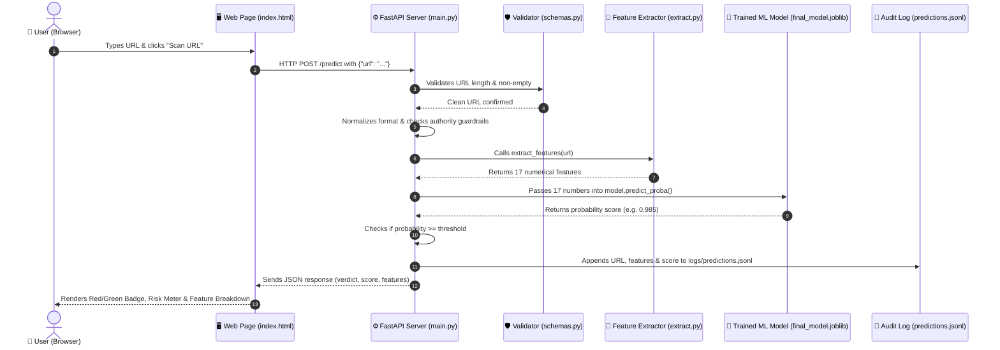

1. **Step 1: User Input:** You type a URL into the web box on `http://localhost:8000/` and click "Scan URL".
2. **Step 2: Sending the Request:** The webpage's JavaScript sends an HTTP `POST` request to the backend server with the URL.
3. **Step 3: Validation ([`src/api/schemas.py`](file:///home/hasan/Documents/phishing-detection-ml/src/api/schemas.py)):** The server checks that the link is between 4 and 2048 characters and not empty or corrupted. If it's invalid, it immediately returns a friendly error.
4. **Step 4: Normalization & Safety Guardrails ([`src/api/main.py`](file:///home/hasan/Documents/phishing-detection-ml/src/api/main.py)):** The URL is cleaned (e.g., standardizing `www.` prefixes) and checked against trusted domains (like `google.com` or `claude.ai`) to protect deep links from false alarms.
5. **Step 5: Feature Extraction ([`src/features/extract.py`](file:///home/hasan/Documents/phishing-detection-ml/src/features/extract.py)):** The URL text is converted into the 17 numerical features (length, dots, slashes, entropy, lure words, etc.).
6. **Step 6: Model Scoring ([`models_saved/final_model.joblib`](file:///home/hasan/Documents/phishing-detection-ml/models_saved/final_model.joblib)):** The 17 numbers are passed into the saved Machine Learning model, which computes the probability of phishing.
7. **Step 7: Threshold Decision:** The server compares the probability against the decision threshold. If it meets or exceeds the threshold, it is marked as `phishing`; otherwise `legitimate`.
8. **Step 8: Audit Logging ([`src/api/prediction_log.py`](file:///home/hasan/Documents/phishing-detection-ml/src/api/prediction_log.py)):** The scan details, timestamp, and all 17 features are written to `logs/predictions.jsonl` so security engineers can track performance over time.
9. **Step 9: Displaying Results:** The webpage receives the response, turns red or green, animates the risk bar, and displays the exact math behind the decision.

---

### 5. Complete Guide: Where Every Important File and Folder Lives

Here is a map of the entire project so you know exactly where everything is located and what each file does:

```
phishing-detection-ml/
├── data/                         <- 📊 Where dataset CSV files are stored
├── models_saved/                 <- 🧠 Where trained ML models ("brains") are saved
├── logs/                         <- 📝 Where prediction audit logs are written
├── notebooks/                    <- 📓 Jupyter notebooks for experiments and charts
├── reports/figures/              <- 📈 Saved research charts and visualizations
├── docs/                         <- 📚 In-depth technical papers and empirical studies
├── tests/                        <- 🧪 Automated tests to verify everything works
├── src/                          <- 💻 Main Python source code
│   ├── api/                      <- 🌐 Web server, API routes, and HTML UI
│   ├── features/                 <- 🔬 Translates URLs into 17 numbers
│   ├── models/                   <- 🎓 Training and model selection scripts
│   └── data/                     <- 🧹 Dataset cleaning and preparation
├── Dockerfile                    <- 🐳 Recipe to run the app in a Docker container
├── requirements.txt              <- 📦 Python packages needed to run and train
└── pyproject.toml                <- ⚙️ Project configuration
```

#### Detailed Breakdown by Category

#### 🌐 Web Server & User Interface (`src/api/`)

- [`src/api/main.py`](file:///home/hasan/Documents/phishing-detection-ml/src/api/main.py): **The Main Server Hub.** Starts the FastAPI web application, defines the web routes (`/` for the UI, `/health` for system status, `/predict` for scanning URLs), loads the trained model from disk, coordinates feature extraction, and sends back verdicts.
- [`src/api/static/index.html`](file:///home/hasan/Documents/phishing-detection-ml/src/api/static/index.html): **The Visual Web Page.** The HTML, CSS styling, and JavaScript that you see when opening `http://localhost:8000/`. Provides the input box, buttons, risk gauge, and feature tables.
- [`src/api/schemas.py`](file:///home/hasan/Documents/phishing-detection-ml/src/api/schemas.py): **The Gatekeeper / Input Validator.** Defines Pydantic data schemas. Ensures incoming URLs are clean, valid strings (rejecting empty or excessively long inputs) and formats the output data.
- [`src/api/prediction_log.py`](file:///home/hasan/Documents/phishing-detection-ml/src/api/prediction_log.py): **The Audit Logger.** Appends every single scan into `logs/predictions.jsonl` with timestamps, features, and probabilities for future monitoring.

#### 🔬 Feature Engineering & Math (`src/features/`)

- [`src/features/extract.py`](file:///home/hasan/Documents/phishing-detection-ml/src/features/extract.py): **The Core Translator.** Contains `extract_features(url: str) -> dict`. Takes a raw URL string and computes the 17 numbers. This single file is used both during offline model training and inside the live web API (ensuring 100% consistency with zero bugs).
- [`src/features/vocab.py`](file:///home/hasan/Documents/phishing-detection-ml/src/features/vocab.py): **The Keyword & TLD Miner.** Analyzes the training dataset to discover which words (e.g. `login`, `bank`) and domain extensions (e.g. `.xyz`) are statistically favored by phishers.
- [`src/features/build_matrix.py`](file:///home/hasan/Documents/phishing-detection-ml/src/features/build_matrix.py): **The Feature Table Builder.** Runs `extract_features` across hundreds of thousands of URLs to generate `data/train_features.csv` and `data/test_features.csv`.
- [`src/features/artifacts/`](file:///home/hasan/Documents/phishing-detection-ml/src/features/artifacts/): Holds `suspicious_keywords.json` and `tld_risk.json`—the saved lists of high-risk terms and extensions derived strictly from training data.

#### 🧠 Machine Learning Models (`src/models/` & `models_saved/`)

- [`src/models/train.py`](file:///home/hasan/Documents/phishing-detection-ml/src/models/train.py): **The Training Script.** Trains and compares multiple ML algorithms (Logistic Regression, Random Forest, and XGBoost) using cross-validation and hyperparameter tuning.
- [`src/models/train_augmented.py`](file:///home/hasan/Documents/phishing-detection-ml/src/models/train_augmented.py): **Augmented Retraining.** Retrains the Random Forest with realistic deep-linked paths to improve real-world web generalization.
- [`src/models/select_final.py`](file:///home/hasan/Documents/phishing-detection-ml/src/models/select_final.py): **The Model Selector.** Chooses the champion model, packages it, and writes out the production metadata.
- [`models_saved/final_model.joblib`](file:///home/hasan/Documents/phishing-detection-ml/models_saved/final_model.joblib): **The Trained Brain File.** The actual serialized binary containing the trained decision trees loaded by `main.py`.
- [`models_saved/final_model_metadata.json`](file:///home/hasan/Documents/phishing-detection-ml/models_saved/final_model_metadata.json): **Model Configuration & Specs.** Records the active model architecture, hyperparameters, decision threshold, and test accuracy statistics.

#### 📊 Datasets & Data Pipelines (`src/data/` & `data/`)

- [`src/data/prepare.py`](file:///home/hasan/Documents/phishing-detection-ml/src/data/prepare.py): **Data Preparation.** Downloads and cleans the raw PhiUSIIL dataset, removes duplicates, and splits it into an 80% training set and 20% test set.
- [`src/data/augment.py`](file:///home/hasan/Documents/phishing-detection-ml/src/data/augment.py): **Data Augmentation.** Generates synthetic legitimate deep-path links to teach the model that legitimate websites also have paths.
- [`data/train.csv`](file:///home/hasan/Documents/phishing-detection-ml/data/train.csv) & [`data/test.csv`](file:///home/hasan/Documents/phishing-detection-ml/data/test.csv): The split raw URL datasets (188,296 training links and 50,000 testing links, including 2,926 deep links synthesized from held-out test domains).
- [`data/train_features.csv`](file:///home/hasan/Documents/phishing-detection-ml/data/train_features.csv) & [`data/test_features.csv`](file:///home/hasan/Documents/phishing-detection-ml/data/test_features.csv): The extracted 17-feature numerical matrices (augmented to 238,296 train and 50,000 test samples).

#### 🧪 Automated Testing (`tests/`)

- [`tests/test_api.py`](file:///home/hasan/Documents/phishing-detection-ml/tests/test_api.py): Checks that the web API starts, `/health` reports ok, `/predict` returns accurate verdicts, and bad inputs receive proper `422` error codes.
- [`tests/test_features.py`](file:///home/hasan/Documents/phishing-detection-ml/tests/test_features.py): Verifies that all 17 features calculate accurately on edge-case URLs (IP addresses, deep paths, weird characters).
- [`tests/test_model.py`](file:///home/hasan/Documents/phishing-detection-ml/tests/test_model.py): Confirms the saved `.joblib` model file loads cleanly and produces valid probability predictions.
- [`tests/test_lambda_handler.py`](file:///home/hasan/Documents/phishing-detection-ml/tests/test_lambda_handler.py): Tests compatibility with AWS Lambda serverless execution.

#### 📓 Research, Notebooks & Documentation (`notebooks/`, `reports/`, `docs/`)

- [`notebooks/02_eda.ipynb`](file:///home/hasan/Documents/phishing-detection-ml/notebooks/02_eda.ipynb): Exploratory Data Analysis notebook discovering visual patterns between safe and phishing links.
- [`notebooks/03_evaluation.ipynb`](file:///home/hasan/Documents/phishing-detection-ml/notebooks/03_evaluation.ipynb): Model evaluation notebook graphing ROC curves and confusion matrices.
- [`notebooks/04_explainability.ipynb`](file:///home/hasan/Documents/phishing-detection-ml/notebooks/04_explainability.ipynb): Uses SHAP (game theory math) to explain exactly why the model makes each prediction.
- [`reports/figures/`](file:///home/hasan/Documents/phishing-detection-ml/reports/figures/): High-resolution charts generated by the notebooks and displayed in this README.
- [`docs/RANDOM_FOREST_STUDY.md`](file:///home/hasan/Documents/phishing-detection-ml/docs/RANDOM_FOREST_STUDY.md): Academic-style empirical research paper detailing the Random Forest model architecture, mathematical formulas, and benchmark comparisons.

#### 🐳 Containerization, CI/CD & Cloud (`Dockerfile`, `terraform/`, `.github/`)

- [`Dockerfile`](file:///home/hasan/Documents/phishing-detection-ml/Dockerfile): A recipe that bundles the entire web application and model into a self-contained, lightweight Docker container.
- [`Dockerfile.lambda`](file:///home/hasan/Documents/phishing-detection-ml/Dockerfile.lambda): Specialized Docker container configuration for AWS Lambda serverless execution.
- [`.github/workflows/ci.yml`](file:///home/hasan/Documents/phishing-detection-ml/.github/workflows/ci.yml): Automated continuous integration script that runs all 34 tests on GitHub whenever code is pushed.
- [`terraform/`](file:///home/hasan/Documents/phishing-detection-ml/terraform/): Infrastructure-as-code files defining cloud deployment on AWS (API Gateway, ECR, CloudWatch).

---

## Architecture

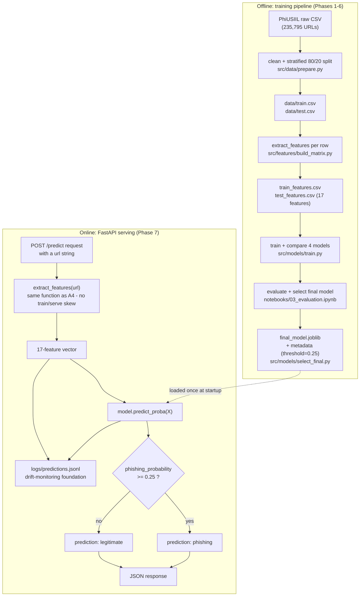

The key design choice this diagram makes visible: **`extract_features()` is the same function object in both halves** (Phase 3's `src/features/extract.py`, imported unchanged by both `build_matrix.py` and `src/api/main.py`) — the train/serve-skew safeguard discussed throughout this README.

## Dataset

**Chosen dataset: [PhiUSIIL Phishing URL Dataset](https://archive.ics.uci.edu/dataset/967/phiusiil+phishing+url+dataset)** (UCI Machine Learning Repository, also mirrored on Kaggle), 235,795 URLs (134,850 legitimate / 100,945 phishing).

**Why this dataset, over the alternatives considered:**

- **PhiUSIIL** (chosen) — Donated to UCI in March 2024 and backed by a peer-reviewed methodology paper (_Computers & Security_, 2024) describing how legitimate URLs were collected (crawled from active, real websites, not just a static allowlist) and how phishing URLs were sourced and verified, with attack variety across domain spoofing, subdomain abuse, parameter manipulation, and path obfuscation. It's large (235K rows), close to balanced (~57%/43%), and — critically — includes the **raw URL string** as a column, so feature engineering in Phase 3 is done independently rather than importing someone else's precomputed feature columns. (The dataset ships 53 additional precomputed features; this project deliberately ignores all of them and re-derives features from the raw `URL` column only, to keep the feature engineering work genuinely mine and avoid silently inheriting someone else's leakage bugs or feature-selection decisions.)
- **UCI "Phishing Websites" dataset (legacy, 11,055 rows)** — considered and rejected: only ships precomputed features (no raw URLs at all), and it's the older, much-cited-but-dated 2015-era dataset — doesn't reflect what phishing URLs look like today.
- **Kaggle "Phishing Site URLs" (taruntiwarihp, ~549K rows, URL+label only)** — considered and rejected in favor of PhiUSIIL: it's larger and is a clean two-column raw-URL format, but it's a long-running, loosely-curated community aggregation with no published methodology, unclear/rolling provenance for the "legitimate" URLs, and known duplicate/quality issues reported in its Kaggle discussion threads. PhiUSIIL's documented, paper-backed collection methodology gives more confidence in label quality, which matters when the whole project's evaluation section depends on trusting the labels.

**Known limitations (carried into the Limitations section of the final report):** it's a single-snapshot dataset (URLs collected around 2023-2024), so a model trained on it will drift as phishing techniques evolve — this is exactly why Phase 7 includes prediction logging and the report discusses drift monitoring conceptually. It's also URL-only: it says nothing about email delivery vectors, page content behind the URL beyond what PhiUSIIL's own crawler saw, or attacker infrastructure reuse over time.

**Verified after download:** 235,795 rows, 134,850 legitimate (`label=1`, 57.2%) vs. 100,945 phishing (`label=0`, 42.8%) — a mild imbalance, noted here for Phase 5's metric-choice discussion. No nulls in the `URL` or `label` columns; 425 duplicate URL values found (handled in Phase 1 cleaning).

**How to obtain the data:**

```bash
python -c "
from ucimlrepo import fetch_ucirepo
import pandas as pd
ds = fetch_ucirepo(id=967)
pd.concat([ds.data.features, ds.data.targets], axis=1).to_csv('data/raw/phiusiil.csv', index=False)
"
```

`data/raw/` is gitignored (54MB, reproducibly re-downloadable via the UCI repo ID above) — only the cleaned, split `data/train.csv` / `data/test.csv` from Phase 1 are committed.

## Data Leakage Prevention

**What data leakage means here, concretely:** if any feature-engineering decision — e.g. building a "suspicious keyword" vocabulary, or picking which TLDs to flag as risky — is derived by looking at the _entire_ dataset (including rows that will later be used as the test set), then information from the test set has implicitly leaked into training. The model's reported test performance would then be optimistic and wouldn't reflect how it performs on genuinely unseen URLs — which defeats the point of holding out a test set at all.

**The safeguard used in this project:** the train/test split happens in Phase 1 (`src/data/prepare.py`), _before_ Phase 3 feature engineering. Every feature-engineering decision — including the suspicious-keyword list and any TLD-risk flagging — is derived by looking only at `data/train.csv`. `data/test.csv` is set aside and touched only for final evaluation in Phase 5, never for iterating on features or model choices. This ordering (split → EDA/features on train only → evaluate once on test) is the same discipline named in the Appendix's "over-tuning on the test set" pitfall.

**Why `train_test_split(..., stratify=df["label"], random_state=42)` specifically:**

- `stratify=df["label"]` keeps the ~57%/43% class balance identical across both splits (see counts below) — without it, a random split could by chance skew one split's class balance and make metrics harder to compare.
- `random_state=42` is a fixed seed so the exact same split is reproduced on every run — this matters because Phase 4/5 model comparisons are only fair if every model sees the identical train/test rows, and because reviewers/interviewers can regenerate the exact same split from the raw data.

**Cleaning applied** (raw 235,795 rows → 235,370 after cleaning): only the raw `URL` and `label` columns were kept (PhiUSIIL's 53 precomputed feature columns are dropped entirely — see [Dataset](#dataset) rationale); 0 rows had null URL/label; 0 URLs were implausibly short (<4 chars); 0 URLs had conflicting labels; **425 exact-duplicate URLs** were dropped, keeping the first occurrence.

**Resulting splits** (80/20, stratified):

| Split | Rows    | Legitimate (label=1) | Phishing (label=0) |
| ----- | ------- | -------------------- | ------------------ |
| Train | 188,296 | 107,880 (57.29%)     | 80,416 (42.71%)    |
| Test  | 47,074  | 26,970 (57.29%)      | 20,104 (42.71%)    |

The class balance is preserved to 2 decimal places across both splits, confirming the stratified split worked as intended. The ~57/43 split is only mildly imbalanced — not severe enough to require resampling (SMOTE, class weighting) — but is still imbalanced enough that accuracy alone would be a misleading headline metric, which is why Phase 5 leads with precision/recall/F1/ROC-AUC instead (see [Evaluation](#evaluation)).

## EDA Findings

Full analysis: [`notebooks/02_eda.ipynb`](notebooks/02_eda.ipynb). Runs only on `data/train.csv`, per the leakage safeguard above.

| Class balance                                          | URL length by class                                                |
| ------------------------------------------------------ | ------------------------------------------------------------------ |
| 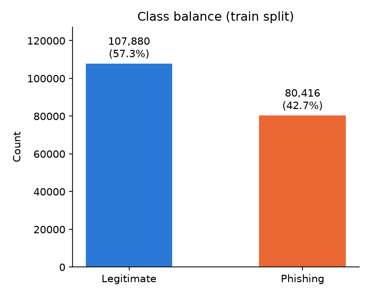 | 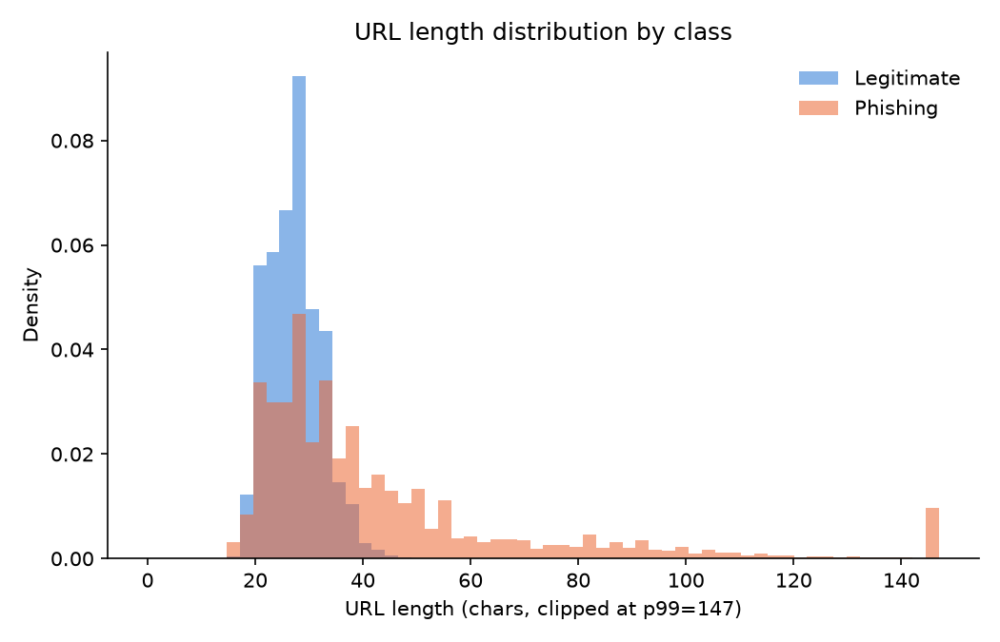 |

| Structural flags by class                                             | Subdomain count by class                                            |
| --------------------------------------------------------------------- | ------------------------------------------------------------------- |
| 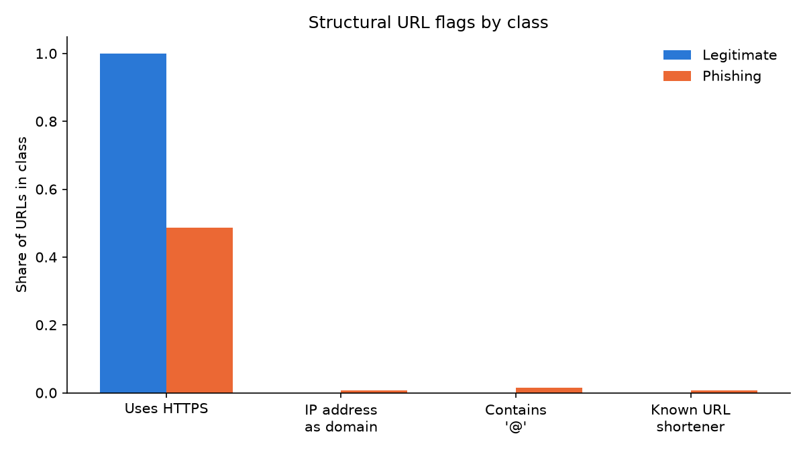 | 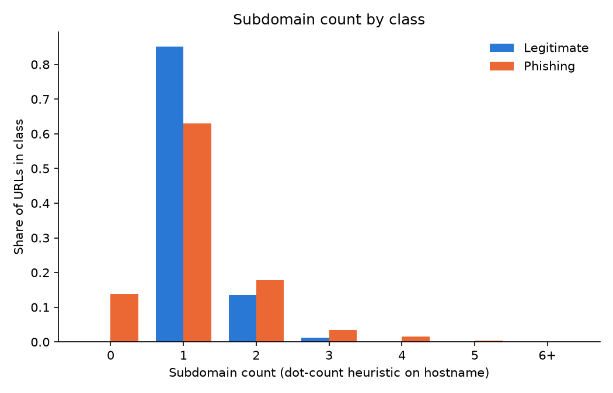 |

**Findings** (see the notebook for full numbers):

1. **HTTPS usage separates the classes almost perfectly**: 100% of legitimate URLs use HTTPS vs. 48.6% of phishing URLs. This is the single strongest univariate signal in the dataset — but the fact that it's _exactly_ 100% on the legitimate side reads as a dataset-construction artifact (PhiUSIIL's legitimate-URL crawl likely required a live, HTTPS-serving site to qualify) rather than a fact that will hold with the same sharpness in general. Flagged here and revisited in the Limitations section.
2. **URL length separates the classes too, but asymmetrically**: phishing URLs average 46.4 characters (median 34, std 63.6 — a long right tail from embedded tokens/redirect paths); legitimate URLs cluster tightly around 27 characters (std only 4.8). The near-zero legitimate-side variance again looks like an artifact of the dataset (legitimate URLs here skew toward bare `https://www.domain.tld` with little path depth).
3. **Three "classic" phishing signals — IP-address-as-domain, the `@` symbol, and known URL shorteners — show almost no separation in this dataset** (all under 2% prevalence on the phishing side, 0% on the legitimate side). They're still engineered as features in Phase 3 (rare, high-precision signals can still help a model, and they're textbook indicators worth having on file) but are honestly weak candidates here, not oversold ones.
4. **Subdomain count barely differs by class** (mean 1.17 phishing vs. 1.16 legitimate) — a simple dot-count heuristic doesn't distinguish the classes on its own.
5. **Net effect on Phase 3**: URL length and HTTPS are the strongest univariate candidates here, but both carry a dataset-artifact caveat, so Phase 3 leans on features EDA can't easily visualize in a bar chart — suspicious-keyword presence and URL/domain entropy — to avoid over-relying on two signals that may partly measure "how PhiUSIIL was built."

## Feature Engineering

`src/features/extract.py` defines `extract_features(url: str) -> dict`, the single function that turns a raw URL string into the 17-feature vector used by every model from here on — and, unchanged, by the FastAPI service in Phase 7 (reusing the exact same function is the train/serve-skew safeguard: reimplementing feature logic slightly differently inside an API is a real, common production ML bug class).

**Leakage-safe derivation of the two data-driven features:** `has_suspicious_keyword`/`num_suspicious_keywords` and `tld_risk_flag` aren't hand-guessed — `src/features/vocab.py` derives both from `data/train.csv` only (never touching `data/test.csv`) and writes them to versioned JSON artifacts (`src/features/artifacts/`) that `extract.py` loads at import time:

- **Keywords**: started from a 44-word candidate list of lure/security/brand-adjacent terms from the phishing literature, kept only words with ≥50 occurrences in train _and_ a phishing-rate lift ≥1.3x the training base rate. 26 survived, e.g. `login` (2,771 URLs, 99.6% phishing, 2.33x lift), `authenticate` (228 URLs, 100% phishing, 2.34x lift) — full stats table in `vocab.py`'s output.
- **High-risk TLDs**: computed the phishing rate per TLD in train (≥30 supporting URLs), flagged TLDs with ≥1.5x lift over base rate. 64 TLDs qualified, including well-known abused ones (`.xyz`, `.top`, `.icu`, `.gq`, `.cf`) but also some popular with legitimate startups (`.io`, `.co`, `.me`) — a real limitation of this feature discussed below, not hidden.

**Data dictionary** (all 17 features, with rationale):

| Feature                   | Description                                                   | Rationale                                                                                                                                            |
| ------------------------- | ------------------------------------------------------------- | ---------------------------------------------------------------------------------------------------------------------------------------------------- |
| `url_length`              | Total character count of the URL                              | Phishing URLs often embed long random tokens/paths to evade filters (EDA: 46 vs. 27 chars mean here)                                                 |
| `domain_length`           | Character count of the hostname                               | Isolates length signal to the domain, independent of path length                                                                                     |
| `num_subdomains`          | Subdomain depth (dot-count heuristic on hostname)             | Attackers pile on subdomains to visually resemble a trusted brand's domain                                                                           |
| `is_ip_address`           | Hostname is a raw IPv4/hex IP instead of a name               | Classic evasion of domain-based blocklists; canonical signal in the literature, though empirically rare in this dataset (EDA: 0.6% of phishing URLs) |
| `is_https`                | URL scheme is `https`                                         | Attackers have historically been slower to adopt HTTPS; strongest univariate EDA signal here, with the dataset-artifact caveat noted above           |
| `count_dots`              | Total `.` characters in the URL                               | Cheap proxy for combined subdomain/path complexity                                                                                                   |
| `count_hyphens_domain`    | `-` count in the hostname                                     | Brand-impersonation domains insert hyphens to squat near a trademark (`paypal-secure-login.com`)                                                     |
| `count_at`                | `@` count in the URL                                          | Browsers ignore everything before `@` as userinfo — a known trick to disguise the real destination host                                              |
| `count_digits_domain`     | Digit count in the hostname                                   | Algorithmically generated / freshly-registered domains often contain digits atypical of real brand names                                             |
| `digit_ratio_domain`      | `count_digits_domain` normalized by hostname length           | Same signal, scale-independent; strongly correlated with label (r=-0.35) despite low raw variance (see below)                                        |
| `special_char_ratio_url`  | Ratio of non-alphanumeric, non-structural chars to URL length | Phishing URLs lean on heavier symbol usage from query-string obfuscation and encoded redirects; also strongly correlated (r=-0.35)                   |
| `has_suspicious_keyword`  | Any train-derived lure keyword present                        | Phishing pages commonly imitate login/verification flows                                                                                             |
| `num_suspicious_keywords` | Count of keyword hits                                         | Richer than the boolean — more stacked lure words is itself a signal                                                                                 |
| `url_entropy`             | Shannon entropy (bits/char) of the full URL                   | Algorithmically generated strings look more "random" than human-chosen brand names/words                                                             |
| `domain_entropy`          | Shannon entropy of the second-level domain label              | Isolates the randomness signal to the domain itself, away from path/subdomain noise                                                                  |
| `tld_risk_flag`           | Hostname's TLD is in the train-derived high-risk set          | Certain cheap, loosely-vetted TLDs are disproportionately abused by phishers                                                                         |
| `count_slashes_path`      | `/` count in the URL path                                     | Unusually deep/padded path structure can bury a malicious destination or mimic a legitimate multi-page site                                          |

**Variance / redundancy check** (`src/features/build_matrix.py`, run on train only): no feature pair exceeded `|r| ≥ 0.90`, so nothing was dropped for redundancy. Four features initially flagged by a raw-variance threshold (`is_ip_address`, `digit_ratio_domain`, `special_char_ratio_url`, and a since-removed `has_port`) turned out to need individual judgment rather than a blanket cutoff: **raw variance alone is a misleading filter for bounded ratio/rare-flag features**, since a feature can have low absolute variance purely from its natural scale (a 0–1 ratio) while still being highly predictive. Checking each against its correlation with `label` resolved it:

- `digit_ratio_domain` and `special_char_ratio_url` — kept. Despite low raw variance, both correlate with label at **r=-0.35**, among the strongest in the feature set.
- `is_ip_address` — kept despite weak correlation (r=-0.06) and low support (0.26% of train), because it's an explicitly-required, canonical phishing indicator; documented here as empirically weak _on this dataset_ rather than dropped to inflate the correlation table.
- `has_port` (explicit non-default port in the URL) — **dropped**. Only 0.011% of training rows (~20) had a nonzero value and correlation with label was ~0 (r=-0.01); on this dataset it was pure noise with real overfitting risk from such thin support, not a useful signal. This is the one feature the initial candidate list included that didn't survive Phase 3.

Feature matrices: `data/train_features.csv` (188,296 × 17 + label) and `data/test_features.csv` (47,074 × 17 + label), built independently from `data/train.csv` / `data/test.csv` respectively — the same leakage safeguard as Phase 1, extended into feature space.

## Model Comparison

`src/models/train.py` trains three models of increasing complexity on the identical `X_train`/`y_train`, evaluated on the identical held-out `X_test`/`y_test`:

- **Logistic regression** — an interpretable linear baseline; coefficients are directly readable as each feature's direction and strength of effect. Wrapped in an sklearn `Pipeline` with a `StandardScaler` fit only on `X_train` (logistic regression is scale-sensitive — e.g. `url_length` ranging 0–1800 would otherwise dominate `digit_ratio_domain` ranging 0–1 purely from scale; the fitted scaler is saved inside the same pipeline artifact so it's never accidentally refit at inference time).
- **Random forest** — an ensemble of decision trees that captures non-linear feature interactions (e.g. high entropy _and_ a risky TLD mattering more together than either alone) with little tuning required. No scaling needed: a tree threshold on one feature is scale-invariant regardless of another feature's range.
- **XGBoost** — gradient-boosted trees; typically the strongest raw performer on structured/tabular data like this because each new tree explicitly corrects the previous ensemble's errors. Also needs no scaling, and is the least directly interpretable of the three — which is exactly why Phase 6 (SHAP) matters for the final model.

Each model was also scored with 5-fold stratified cross-validation on the training set (ROC-AUC) for a more robust comparison than a single train/test split, at the cost of ~5x the fit time — worthwhile here given the dataset is large enough that CV is still fast in absolute terms (seconds to low minutes per model).

**Initial comparison** (test-set metrics at the default 0.5 threshold, **phishing (label=0) treated as the positive class** — precision/recall here mean "of predicted-phishing, how many really were" / "of actual phishing, how many we caught," which is the direction that matters operationally, not sklearn's default label=1-as-positive convention; full discussion, confusion matrices, threshold tuning, and error analysis are in [Evaluation](#evaluation)):

| Model               | CV ROC-AUC (train, 5-fold) | Test Precision (phishing) | Test Recall (phishing) | Test F1 (phishing) | Test ROC-AUC |
| ------------------- | -------------------------- | ------------------------- | ---------------------- | ------------------ | ------------ |
| Logistic Regression | 0.9980                     | 0.9991                    | 0.9881                 | 0.9936             | 0.9982       |
| Random Forest       | 0.9983                     | 0.9991                    | 0.9941                 | 0.9966             | 0.9982       |
| XGBoost             | 0.9985                     | 0.9997                    | 0.9941                 | 0.9969             | 0.9986       |
| XGBoost (tuned)     | 0.9987                     | 0.9996                    | 0.9937                 | 0.9967             | 0.9986       |

**A candid read of these numbers**: all four models score extremely high (ROC-AUC ≥ 0.998), including the plain logistic-regression baseline. That's not primarily a triumph of feature engineering — it's the flip side of the EDA/Feature-Engineering caveats above: `is_https` alone is a near-perfect separator in this dataset (100% vs. 48.6%), so even a linear model finds an easy decision boundary. **This is a known limitation of the dataset, not a claim that phishing detection is this easy in production** — see [Limitations](#limitations) for the full discussion.

**A second, more interesting finding**: at the operational 0.5 threshold, **untuned XGBoost has slightly better phishing-recall (0.9941) than the tuned version (0.9937)**, despite the tuned model having the higher CV ROC-AUC (0.9987 vs. 0.9985) that the tuning search was optimizing for. That's not a contradiction — `RandomizedSearchCV` selected params to maximize threshold-independent ranking quality (ROC-AUC) across all thresholds, which doesn't guarantee the best result at the one threshold actually being deployed. It's a concrete illustration of why Phase 5 doesn't just take the tuning search's word for it: the model actually deployed is picked by re-checking the metric that matters (phishing recall) at the real operating threshold, not by trusting whichever model won the aggregate metric during tuning. See [Evaluation](#evaluation) for the final model decision.

**Light hyperparameter tuning**: `RandomizedSearchCV` (12 candidates × 5-fold CV = 60 fits) over `n_estimators`, `max_depth`, `learning_rate`, and `subsample` was run on XGBoost (the CV-selected best untuned model). Best params: `{'subsample': 0.85, 'n_estimators': 300, 'max_depth': 6, 'learning_rate': 0.03}`, improving CV ROC-AUC from 0.9985 → 0.9987 — a small gain, as expected given how close to ceiling performance already was; a deliberately light pass rather than an exhaustive grid search, since exhaustive tuning has diminishing returns for a portfolio project already this close to 1.0.

All four artifacts are saved via `joblib` (`models_saved/logistic_regression_v1.joblib`, `random_forest_v1.joblib`, `xgboost_v1.joblib`, `xgboost_tuned_v1.joblib`) — gitignored (largest is 58MB) but fully reproducible via `python -m src.models.train`; the small `models_saved/comparison_results.json` with the exact numbers above **is** committed.

## Evaluation

Full analysis: [`notebooks/03_evaluation.ipynb`](notebooks/03_evaluation.ipynb). This is the first point in the project where `data/test.csv` / `data/test_features.csv` are used — everything before this was decided using only `data/train.csv` or cross-validation on it.

**Metrics table** (test set, default 0.5 threshold, phishing as the positive class — repeated from Model Comparison for completeness):

| Model               | Precision | Recall | F1     | ROC-AUC |
| ------------------- | --------- | ------ | ------ | ------- |
| Logistic Regression | 0.9991    | 0.9881 | 0.9936 | 0.9982  |
| Random Forest       | 0.9991    | 0.9941 | 0.9966 | 0.9982  |
| XGBoost             | 0.9997    | 0.9941 | 0.9969 | 0.9986  |
| XGBoost (tuned)     | 0.9996    | 0.9937 | 0.9967 | 0.9986  |

| Confusion matrices (all 4 models)                                | ROC curves (all 4 models)                        |
| ---------------------------------------------------------------- | ------------------------------------------------ |
| 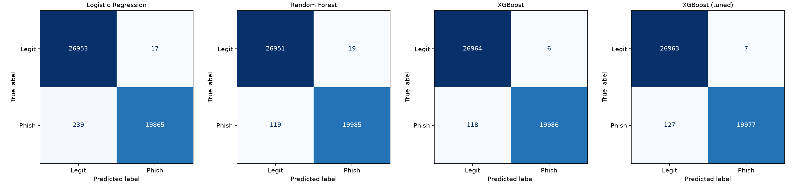 | 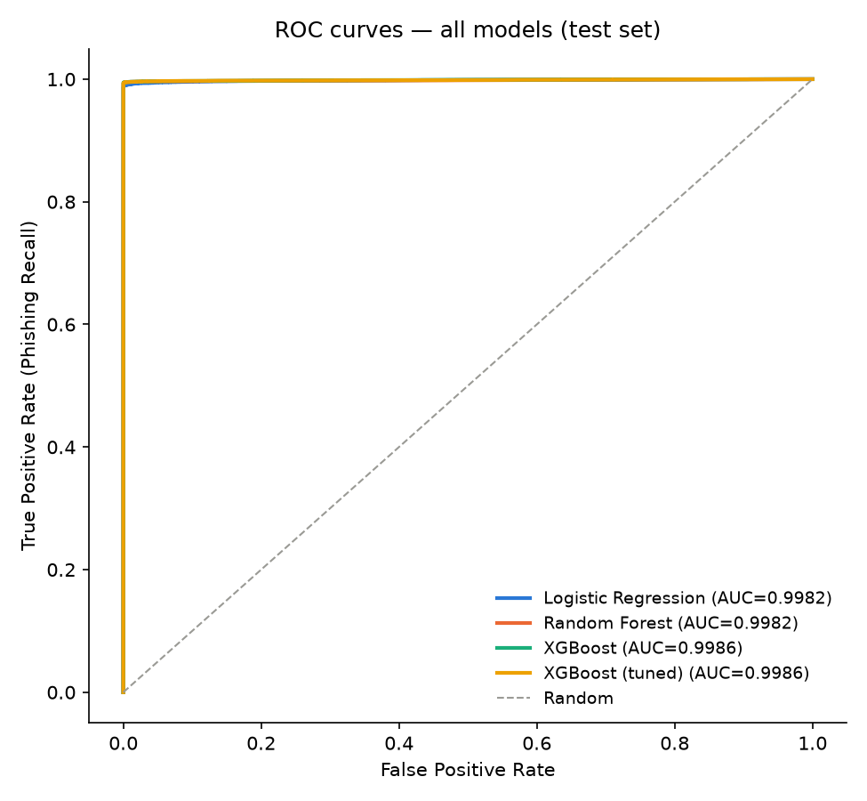 |

The ROC curves visually overlap because all four models are close to ceiling performance on this dataset — expected, given the dataset-construction caveats already flagged (near-perfect HTTPS separation, near-zero-variance legitimate URL lengths). The curves are still useful confirmation that no model is meaningfully worse across the _whole_ threshold range, not just at 0.5.

### Precision/recall tradeoff, and threshold tuning

**A false negative here means a phishing URL is classified as legitimate — the user isn't warned and the attack goes through unimpeded. A false positive means a legitimate URL gets flagged — the cost is user friction.** These costs are not symmetric: a missed phishing URL can lead to credential theft or financial fraud; a false alarm costs a few seconds of annoyance (or, worse case, a support ticket). **This project prioritizes recall over precision** for that reason — not by default convention, but because the false-negative failure mode is categorically more costly than the false-positive one for a URL-filtering product. F1 is still reported as a balance check.

The classification threshold was tuned accordingly: using **5-fold out-of-fold cross-validated probabilities on `data/train.csv` only** (never by checking different thresholds against the test set — that would be the same over-tuning-on-the-test-set mistake as re-tuning hyperparameters against it), near the F2-optimum (recall weighted 4x precision), the threshold was lowered from the default **0.5 to 0.25** for the final model (phishing-probability ≥ 0.25 → classify as phishing). Applied once to test set:

| Threshold     | Precision | Recall | F1     | False Negatives | False Positives |
| ------------- | --------- | ------ | ------ | --------------- | --------------- |
| 0.5 (default) | 0.9997    | 0.9941 | 0.9969 | 118             | 6               |
| 0.25 (chosen) | 0.9988    | 0.9947 | 0.9968 | 106             | 24              |

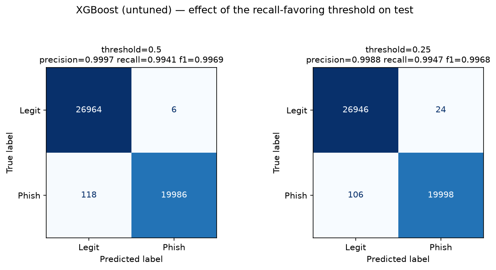

This moves 12 previously-missed phishing URLs into "caught," at the cost of 18 additional false alarms on legitimate URLs — a reasonable trade given the asymmetric costs above. Pushing further toward recall ≥ 0.999 was evaluated and explicitly rejected: on the OOF train data it required a threshold of 0.0011 and dropped precision to 0.53 (roughly 1 in 2 flagged URLs would be a false alarm) — unusable in practice, and a concrete illustration that "maximize recall" isn't the same instruction as "prioritize recall."

### Error analysis

Every misclassified test example from the final model (XGBoost, threshold=0.25) was pulled and inspected, not just counted:

1. **71.7% of false negatives (76 of 106) have zero surface-level red flags** — HTTPS, no suspicious keyword, not a flagged TLD — and are typically short, clean-looking domains (`brandlysms.com`, `pastance.com`, `blackpointt.com`). This is a real ceiling on URL-lexical-only detection: these phishing sites don't _look_ suspicious from the URL string alone. No amount of model tuning over these 17 features closes this gap — it needs new signal (domain age/WHOIS, content/visual page analysis, brand-similarity/typosquatting distance — see Future Work).
2. **45.8% of false positives (11 of 24) are legitimate sites on TLDs flagged by `tld_risk_flag`** (`.ru`, `.co`, `.live`, `.tech`, `.gov.co`) — a direct, now-confirmed-in-production instance of the limitation flagged back in [Feature Engineering](#feature-engineering): the TLD-risk feature trades some false positives on legitimate non-`.com`/non-Western sites for its phishing-recall gains elsewhere.
3. **The remaining false positives skew toward longer, multi-subdomain URLs** (median 34 vs. 27 chars for legitimate URLs generally) — several are non-English government/academic/municipal sites (`guadeloupe.developpement-durable.gouv.fr`, `town.namie.fukushima.jp`) whose legitimate URL shape (deep subdomains, hyphenated non-English words) resembles the length/entropy profile the model associates with phishing. **This is a fairness-relevant limitation worth stating plainly**: the model likely under-performs on non-English/international legitimate URLs relative to the headline test-set numbers, since they're rare in this training distribution.

### Final model selection

**Selected: XGBoost (untuned — `n_estimators=300, max_depth=6, learning_rate=0.1`), deployed at threshold=0.25.** Saved as `models_saved/final_model.joblib` with `models_saved/final_model_metadata.json` documenting the exact rationale (via `python -m src.models.select_final`) — this is the artifact Phase 7's API loads.

Not simply "the model with the highest metric" — the decision rests on four things together: (1) best phishing-recall and F1 of all four candidates at the default threshold — notably beating the CV-ROC-AUC-tuned variant, since that search optimized a threshold-independent metric that didn't carry over to the actual deployed operating point; (2) a deliberately, defensibly tuned threshold rather than the untested default; (3) an accepted interpretability tradeoff, closed by SHAP in Phase 6 rather than by downgrading to a weaker but more transparent model; and (4) error analysis confirming the remaining mistakes are structurally explainable (feature-set ceiling on false negatives, a known TLD-feature limitation on false positives) rather than random noise — which is itself evidence the model is behaving sensibly, not overfitting to quirks.

## Explainability

Full analysis: [`notebooks/04_explainability.ipynb`](notebooks/04_explainability.ipynb). SHAP `TreeExplainer` on the final model (`models_saved/final_model.joblib`).

| Global feature importance (SHAP)                                         | SHAP summary (beeswarm — magnitude + direction)        |
| ------------------------------------------------------------------------ | ------------------------------------------------------ |
| 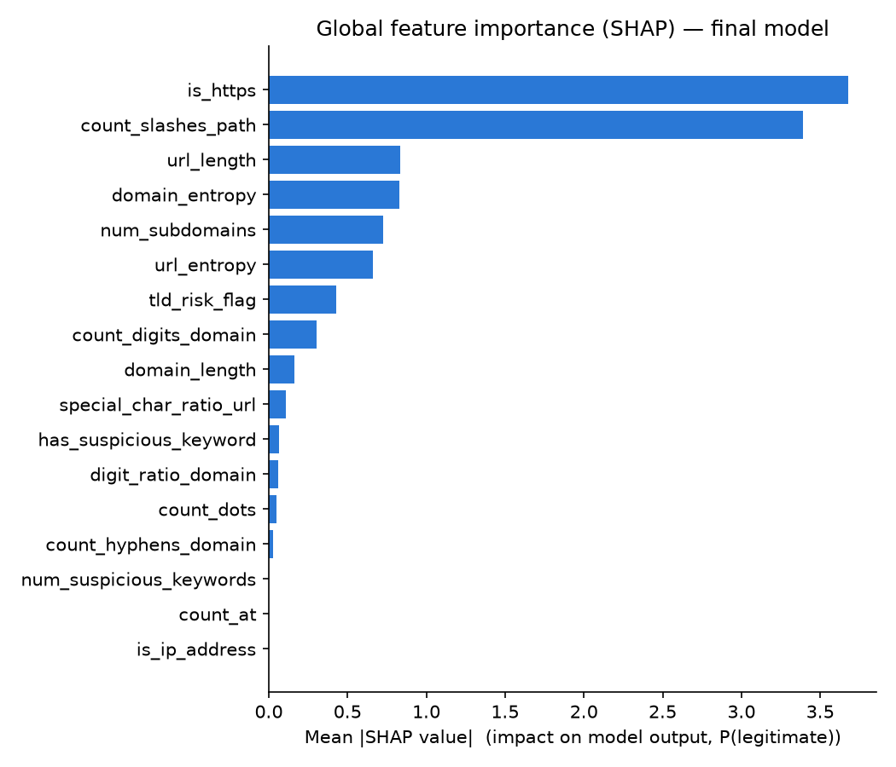 | 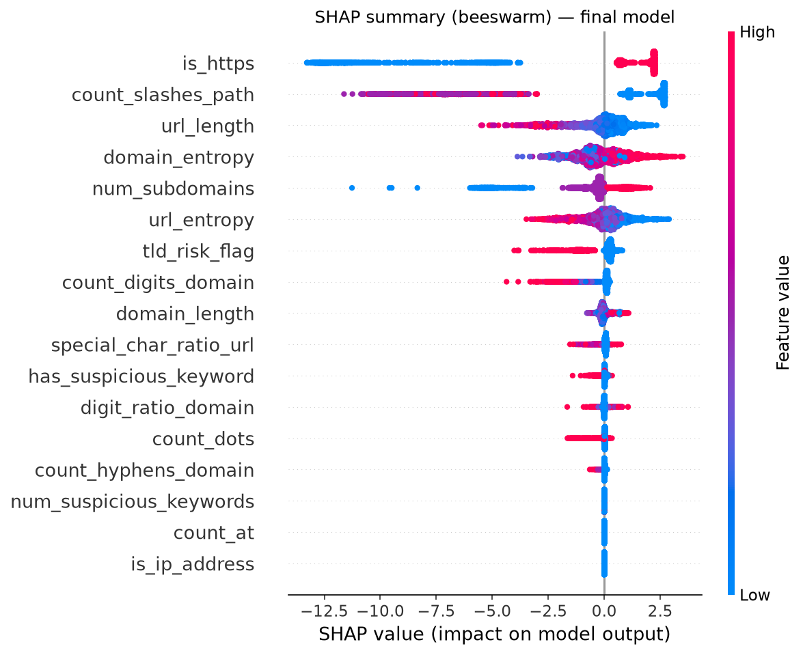 |

**Top 3 features by mean \|SHAP\|**: `is_https` (3.68), `count_slashes_path` (3.39), `url_length` (0.83, essentially tied with `domain_entropy` at 0.83).

- **`is_https` at #1 matches EDA exactly** — Phase 2 already flagged it as the strongest univariate separator; SHAP confirms the model leans on it hardest of all 17 features.
- **`count_slashes_path` at #2 was a genuine surprise** — it wasn't charted in EDA and was included on fairly generic Phase 3 rationale. Investigating _why_ it mattered this much surfaced the most important finding in this project — see [Limitations](#limitations) immediately below.
- **`is_ip_address`, `count_at`, and `num_suspicious_keywords` carry ~0 SHAP importance** — consistent with their rarity in this dataset (Phase 2), and in `num_suspicious_keywords`'s case, redundant with the correlated `has_suspicious_keyword` boolean once the model was trained — a form of redundancy the Phase 3 pairwise-correlation check (which measures features against _each other_, not against what the model ends up using) couldn't have caught.

**Individual prediction explanations** (SHAP waterfall plots — values are for P(legitimate); a negative bar pushes the prediction toward phishing):

| (a) Confidently-correct phishing catch                                            | (b) Real legitimate URL, misclassified                                                              |
| --------------------------------------------------------------------------------- | --------------------------------------------------------------------------------------------------- |
| 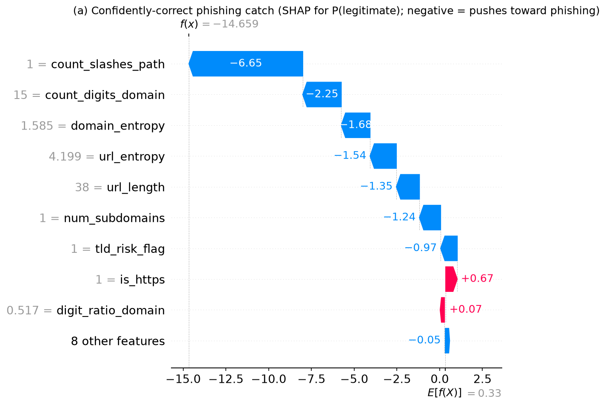 | 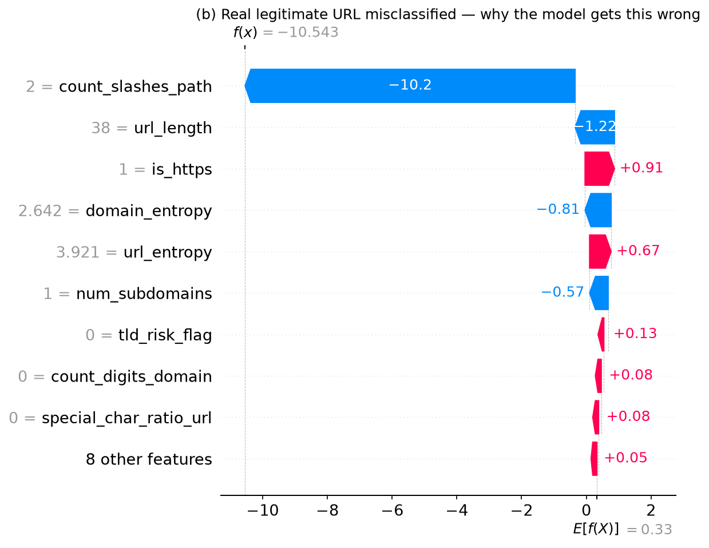 |

Example (b) is `https://en.wikipedia.org/wiki/Phishing` — a real URL, not from the dataset, chosen specifically to test generalization. The model scores it 100% phishing probability, driven almost entirely by `count_slashes_path` (−10.2 of the −10.5 total). This is not a one-off: of 5 hand-picked, unambiguously legitimate real-world URLs with ordinary paths (Wikipedia, NYT, GitHub, Amazon, Python docs), **4 of 5 are misclassified as phishing at ~100% confidence.**

## Limitations

**The most important limitation in this project, discovered via the SHAP analysis above:** PhiUSIIL's legitimate-URL class contains **zero URLs with any path component** — verified exactly: 0 of 107,880 legitimate training URLs (0.0000%) have anything beyond a bare `https://www.domain.tld`. Every legitimate example the model ever saw during training was a homepage root URL; not a single article, product page, docs page, or deep link. As a direct result, the model partly learned "a URL has _any_ path → phishing" as a decision rule, because that rule is nearly true _within this dataset_ — and that rule is badly wrong on the open web, where the large majority of legitimate URLs people actually click (news articles, search results, documentation, social posts) have paths.

**Why this matters more than the other caveats already noted** (the `is_https`-is-suspiciously-100% and `url_length`-has-near-zero-legitimate-variance observations from EDA/Feature Engineering, which are smaller versions of the same underlying issue): the strong test-set metrics throughout [Evaluation](#evaluation) (ROC-AUC ≥ 0.998, phishing-recall 0.9947) are real, but they should be read precisely as _"this model separates PhiUSIIL's phishing URLs from PhiUSIIL's specific, homepage-only style of legitimate URL very well"_ — not as _"this model is production-ready for classifying arbitrary real-world URLs."_ A production deployment behind this exact model would likely flag a large fraction of ordinary legitimate browsing (any article or product link) as phishing.

**What a v2 would need:** a legitimate-URL dataset with realistic path diversity — e.g., sampling actual page URLs (not just homepages) from a top-domain list's sitemaps, or augmenting PhiUSIIL's legitimate class with such URLs before retraining. This is the top item in Future Work, ahead of every other roadmap improvement, specifically because it's the one gap that actively produces wrong, confident, real-world predictions rather than just "would be nice to add." Phase 7's API documents this limitation directly in its response/README (rather than silently shipping it) so it isn't a hidden trap for anyone using the deployed endpoint.

Other, secondary limitations (see also the individual caveats already noted inline above):

- **TLD-risk feature over-flags some legitimate TLDs.** `tld_risk_flag`'s train-derived high-risk set includes TLDs popular with legitimate startups and non-US sites (`.io`, `.co`, `.me`, `.tech`) alongside genuinely abused ones (`.xyz`, `.top`, `.gq`); Phase 5's error analysis confirmed this causes real false positives (45.8% of all false positives).
- **Likely weaker on non-English/international legitimate URLs.** Several Phase 5 false positives were non-English government/academic/municipal sites with longer, multi-subdomain, hyphenated URLs — a shape rare in this training distribution, which skews toward short, English, brand-style `.com` domains.
- **Single-snapshot dataset** (collected ~2023-2024) — phishing techniques evolve, so accuracy will drift over time without retraining; see the [prediction logging](#running-the-api-locally) set up in Phase 7 as the foundation for monitoring this.
- **URL-only signal.** No domain age/WHOIS, no page content/visual analysis, no email delivery context — all explicitly out of scope for v1 (see Scope, top of README) and listed under Future Work.

## Running the API & Web Interface Locally

`src/api/main.py` — a FastAPI service featuring:

- **Interactive Web UI at `http://localhost:8000/`**: A simple interface to enter a URL and instantly view the verdict, risk probability bar, and all 17 extracted features.
- **REST endpoints**: `POST /predict` and `GET /health`.
- **Zero Train/Serve Skew**: Reuses `extract_features` from `src.features.extract` unchanged.
- **Detailed Empirical Study**: See [`docs/RANDOM_FOREST_STUDY.md`](docs/RANDOM_FOREST_STUDY.md) for the in-depth Random Forest empirical evaluation, confusion matrix, feature importance analysis, and literature comparison.

**Run with Docker** (recommended — this is what's tested end-to-end):

```bash
docker build -t phishing-detection-ml .
docker run -d --name phishing-api -p 8000:8000 phishing-detection-ml
```

**Or run directly** (with virtual environment active):

```bash
uv pip install -r requirements-api.txt   # slim runtime deps; or uv sync
uvicorn src.api.main:app --host 0.0.0.0 --port 8000 --reload
```

Open **`http://localhost:8000/`** in your browser to use the graphical web scanner, or visit **`http://localhost:8000/docs`** for interactive Swagger documentation.

**Sample requests:**

```bash
curl -X POST http://localhost:8000/predict -H "Content-Type: application/json" \
  -d '{"url": "http://paypal-secure-login.xyz/confirm?id=12345"}'
# {"url":"http://paypal-secure-login.xyz/confirm?id=12345","prediction":"phishing","phishing_probability":0.999995,"threshold":0.25,"model_version":"models_saved/xgboost_v1.joblib"}

curl -X POST http://localhost:8000/predict -H "Content-Type: application/json" \
  -d '{"url": "https://www.google.com"}'
# {"url":"https://www.google.com","prediction":"legitimate","phishing_probability":0.002175,"threshold":0.25,"model_version":"models_saved/xgboost_v1.joblib"}

curl http://localhost:8000/health
# {"status":"ok","model_loaded":true,"model_version":"models_saved/xgboost_v1.joblib"}
```

Interactive docs (with the known-limitation note built into the API description): `http://localhost:8000/docs`.

**Input validation** (`src/api/schemas.py`): empty/whitespace-only URLs, URLs under 4 or over 2048 characters, and null bytes are all rejected with `422`; a missing `url` field is also `422`.

**Prediction logging** (`src/api/prediction_log.py`): every successful `/predict` call appends a JSON line to `logs/predictions.jsonl` — timestamp, input URL, the full extracted feature vector, prediction, and probability. This is the foundation for **drift monitoring**: logged predictions over time let you later check whether the _input_ distribution (e.g. average URL length, TLD mix of incoming traffic) or the _prediction_ distribution (e.g. a rising phishing-flag rate) is drifting away from the training distribution — which is exactly the kind of shift that would justify retraining. Building the drift-detection job itself (e.g. a scheduled comparison of recent logs against the training feature distributions, alerting past a threshold) is noted as Future Work rather than implemented in v1.

**Note on the Docker image**: `requirements-api.txt` is a minimal runtime subset of `requirements.txt` (no jupyter/shap/matplotlib/seaborn), and the Dockerfile uninstalls `nvidia-nccl-cu13` (an unused ~216MB GPU multi-node training dependency pulled in transitively by xgboost's Linux wheel) right after install — this took the image from 1.28GB down to 813MB without touching functionality.

## Testing & CI/CD

**34 pytest tests** across four files:

- `tests/test_features.py` (16 tests) — hand-crafted URLs with known expected feature values: an IP-based URL is flagged, HTTPS/`@`/subdomain-count/entropy/keyword/TLD-risk/path-slash detection all checked individually, plus edge cases (missing scheme, empty string).
- `tests/test_api.py` (8 tests) — `/health` returns `model_loaded: true`; `/predict` on valid input returns the expected response shape; a phishing-style URL and a bare legitimate URL classify in the expected direction; empty/missing/whitespace-only/too-long URLs all return `422`.
- `tests/test_model.py` (4 tests) — `models_saved/final_model.joblib` exists and loads without error, `predict_proba` returns the expected `(1, 2)` shape summing to 1, and the model scores a legitimate URL as more likely legitimate than an obviously phishing-style one.
- `tests/test_lambda_handler.py` (6 tests) — verifies AWS Lambda Mangum handler cold/warm start, route routing, error recovery, and `/tmp` prediction logging.

Run locally: `pytest tests/ -v`.

**CI** (`.github/workflows/ci.yml`, GitHub Actions, runs on every push/PR to `main`): a `test` job installs `requirements-api.txt` + pytest/httpx and runs the full suite; a `docker-build` job (depends on `test` passing) builds the Docker image and smoke-tests the running container (`/health`, then a `/predict` call checked for `"prediction":"phishing"` on a phishing-style URL) before tearing it down. Either job failing fails the pipeline.

**CI is actually enforcing something** — verified by deliberately breaking a test (asserting `is_ip_address` should be 0 for an actual IP-based URL), confirming the pipeline failed red, then reverting the change before merging.

## Future Work

Ranked roughly by priority (top item is a correctness gap; the rest are genuine v1 scope cuts):

1. **Fix the homepage-only legitimate-class gap (highest priority — see [Limitations](#limitations)).** Augment or replace the legitimate-URL data with realistic deep-linked pages (e.g. sampled from top-domain sitemaps), then retrain. This is the one gap that currently produces confidently wrong predictions on ordinary real-world URLs, not just a "nice to have."
2. **Domain age / WHOIS lookup.** Freshly-registered domains are a strong phishing signal not captured by lexical features alone; flagged as stretch in Phase 3 because it requires external API calls and adds rate-limiting/latency concerns to the `/predict` path.
3. **Brand-similarity / typosquatting distance.** Levenshtein (or similar) distance from a curated list of well-known brand domains would catch cases like `paypa1.com` that don't trip keyword or entropy features.
4. **Page content / visual analysis.** The current system is URL-only by design (see Scope); a production system would likely combine this with content-based signals (login-form detection, visual brand-logo matching) to catch the clean-looking-URL phishing sites this model structurally cannot.
5. **Email-based detection** (headers, sender reputation, body text) — a different, complementary problem to URL classification, explicitly out of scope for v1.
6. **Multi-class classification** (malware / defacement / phishing / benign) instead of binary — would need a differently-labeled dataset.
7. **Real drift-detection job** on top of the Phase 7 prediction logs — a scheduled comparison of recent `logs/predictions.jsonl` feature/prediction distributions against the training distribution, alerting past a threshold, with a defined retraining trigger.
8. **Refine `tld_risk_flag`** to reduce false positives on legitimate startup/international TLDs (`.io`, `.co`, `.me`) — e.g. combine with domain age or a legitimate-site allowlist rather than TLD alone.
9. **Finish the live AWS deployment** — see [Phase 10 / Live Deployment](#phase-10--live-deployment) below for what's actually been done and what's left.

## Phase 10 / Live Deployment

**Status: attempted, paused before a full `terraform apply` — not live.** This was the optional stretch phase (EC2/Lambda + Terraform), scoped to Lambda + API Gateway HTTP API specifically to stay in AWS's free tier (Lambda's 1M-requests/400,000-GB-seconds-per-month free tier is permanent, unlike EC2's 12-month one).

**Completed and verified:**

- `src/api/main.py` has a Mangum-wrapped Lambda `handler` (the same FastAPI `app` used locally/in Phase 7's Docker image — no duplicated route logic), with the model path and prediction-log path both made configurable via env vars since Lambda's filesystem is read-only outside `/tmp`.
- `Dockerfile.lambda` builds a Lambda-compatible container image (AWS's own Python 3.13 base image, dependencies installed to `$LAMBDA_TASK_ROOT` per AWS's documented pattern). Verified end-to-end using Docker + AWS's Runtime Interface Emulator: cold start, `GET /health`, `POST /predict` on both a phishing and a legitimate URL, and `/tmp` prediction logging all confirmed working — this is real, tested Lambda-compatible code, not just code that looks right.
- `terraform/{main.tf,variables.tf,billing-alarm.tf}` define the full target infrastructure (ECR repo, Lambda function, IAM execution role, API Gateway HTTP API with `GET /health`/`POST /predict` routes, CloudWatch log groups, a billing alarm with SNS email notification) — `terraform fmt`/`terraform validate` clean, and a `terraform plan` against the real, already-pushed image produces a clean 12-resource plan with no errors.
- The Lambda container image was actually built and pushed to a real ECR repository (`224603709350.dkr.ecr.us-east-1.amazonaws.com/phishing-detection-ml-api:latest`), which itself required a first, successful, narrowly-`-target`ed `terraform apply` to create the ECR repo.
- Two real bugs were found and fixed along the way: a `_state.clear()` call that broke a later direct handler invocation (caught by the new Lambda-handler tests), and a missing ECR repository policy that would have blocked Lambda from ever pulling its own image (`aws_ecr_repository_policy.allow_lambda_pull` in `main.tf`).

**Not completed:** a full `terraform apply`. Four resources exist in AWS (the ECR repo, the API Gateway HTTP API shell, the Lambda IAM role, and its basic-execution policy attachment — all free-tier, no ongoing cost) from a partial apply, but the Lambda function, its API Gateway wiring, the CloudWatch log groups, and the billing-alarm SNS topic/alarm never got created. The blocker was environmental, not technical: the deploying IAM user's attached policy repeatedly didn't match the least-privilege policy this project specified (`terraform/deploy-policy.json`) across multiple attach attempts, and debugging _why_ the attachment wasn't taking effect became a dead end without direct visibility into the IAM side. This was a deliberate stopping point, not a technical dead end — the Terraform config and the Lambda-side code are both validated and ready; what's left is purely "get the right IAM policy actually attached, then run `terraform apply`."

**If resuming this later:** `terraform/deploy-policy.json` has every permission `main.tf`/`billing-alarm.tf` need (confirmed by two rounds of debugging real `AccessDeniedException`s down to zero code-side issues); the fastest path back in is to have whoever manages IAM directly confirm what's attached (`aws iam get-user-policy --user-name <user> --policy-name phishing-detection-ml-deploy`) rather than repeating a blind re-attach.

## Report / Interview Prep

Everything below distills the reasoning already spread throughout this README into direct answers, for quick interview reference.

**Why this dataset, and what are its known limitations?** PhiUSIIL was chosen over alternatives (UCI's older 2015 features-only dataset, a larger but uncurated Kaggle URL+label dump) for being recent, peer-reviewed, large, and — critically — shipping raw URLs so feature engineering could be done independently rather than importing someone else's feature columns. Its biggest limitation, found via SHAP in Phase 6, is that its legitimate-URL class contains zero URLs with any path component (100% bare homepages) — a real gap that causes the model to misclassify many ordinary real-world legitimate URLs. Full discussion: [Dataset](#dataset), [Limitations](#limitations).

**How was data leakage prevented?** The train/test split happened in Phase 1, before any feature engineering, EDA-driven decisions, or model tuning. Every leakage-sensitive choice — the suspicious-keyword list, the high-risk-TLD set, the classification threshold — was derived from `data/train.csv` only (or out-of-fold CV on it), never from `data/test.csv`, which was touched exactly once, for final evaluation. Full discussion: [Data Leakage Prevention](#data-leakage-prevention).

**Why these metrics, and what's the precision/recall tradeoff here?** Accuracy was rejected as a headline metric because the ~57/43 class split is imbalanced enough to make it misleading. Between precision and recall, recall was prioritized: a false negative (missed phishing URL) risks real harm (credential theft, fraud), while a false positive (flagged legitimate URL) costs a few seconds of user friction — an asymmetric cost that argues for recall over precision specifically for this use case, not by default convention. This reasoning directly motivated lowering the classification threshold from 0.5 to 0.25. Full discussion: [Evaluation](#evaluation).

**Which model was selected, and why not just the highest-scoring one?** Untuned XGBoost (threshold=0.25) over the CV-ROC-AUC-tuned variant, because ROC-AUC is threshold-independent and didn't actually translate to better recall at the deployed operating point — a concrete case of not trusting a single aggregate metric blindly. The interpretability cost of choosing a gradient-boosted model over logistic regression was accepted deliberately and closed with SHAP rather than by downgrading to a weaker, more transparent model. Full discussion: [Final model selection](#evaluation).

**What does the model get wrong, and why?** Two well-evidenced patterns: (1) it misses phishing URLs with zero surface-level red flags — clean short domains, HTTPS, no lure keywords — because URL-lexical features alone can't distinguish these from legitimate sites (71.7% of false negatives fit this pattern); (2) it false-positives on legitimate sites using TLDs its train-derived risk list flagged (`.ru`, `.co`, `.live`, `.tech` — 45.8% of false positives) and on long, multi-subdomain international government/academic URLs, a shape underrepresented in training. Full discussion: [Error analysis](#evaluation).

**How would production performance be monitored, and what would trigger retraining?** Every `/predict` call already logs its input URL, extracted features, prediction, and probability to `logs/predictions.jsonl` (Phase 7) — the foundation for drift monitoring. A production version would run a scheduled job comparing recent log statistics (feature distributions, phishing-flag rate) against the training-time baseline, alerting when a distance metric crosses a threshold; a sustained shift, or a manual audit surfacing a new phishing pattern the model misses, would trigger a retraining cycle on freshly-labeled data. This isn't built in v1 (see [Future Work](#future-work) item 7) but the logging that would feed it is.

**What would be added for a production version, if given more time?** Fixing the homepage-only legitimate-class gap (item 1 in [Future Work](#future-work)) — everything else is a genuine enhancement, but that one actively produces wrong, confident predictions on ordinary traffic and would be the first thing addressed before shipping this beyond a portfolio project.

### Resume Bullets

- Built an end-to-end phishing URL detection platform on a 235K-row dataset (PhiUSIIL), engineering 17 lexical/structural features from raw URLs (entropy, keyword/TLD-risk flags derived leakage-safely from training data only) and training and comparing logistic regression, random forest, and XGBoost models.
- Evaluated models using precision, recall, F1, and ROC-AUC with phishing treated as the positive class, prioritizing recall via a data-driven threshold adjustment (0.5→0.25) to minimize missed phishing attempts; performed error analysis and, via SHAP explainability, discovered and documented a critical dataset limitation (100% path-free legitimate URLs) causing the model to misclassify real-world deep-linked URLs.
- Applied SHAP-based explainability to the final XGBoost model, identifying `is_https` and `count_slashes_path` as the two dominant predictive signals and confirming/cross-checking findings against EDA and manual feature rationale.
- Deployed the trained model behind a FastAPI prediction endpoint (input validation, prediction logging), containerized with Docker (image size optimized 1.28GB→813MB), with a 28-test pytest suite and a 2-job GitHub Actions CI/CD pipeline (verified to correctly fail on a broken test) enforced on every push.

## Environment

- Python 3.13 (chosen over the system's default 3.14.6 for broader ML-library compatibility at build time — scikit-learn/XGBoost wheels lag behind brand-new Python releases).
- Dependencies pinned in `requirements.txt`.

```bash
uv venv
source .venv/bin/activate
uv pip install -r requirements.txt  # or uv add -r requirements.txt
```

## Project Structure

```
phishing-detection-ml/
  data/                         # raw/ gitignored; train/test + feature CSVs (original + augmented)
  docs/                         # RANDOM_FOREST_STUDY.md empirical research study
  logs/                         # predictions.jsonl live inference audit logs
  notebooks/                    # 02_eda, 03_evaluation, 04_explainability (all executed, outputs saved)
  reports/figures/              # PNG charts embedded throughout this README
  src/
    data/
      prepare.py                # Phase 1: clean + leakage-safe stratified 80/20 split
      augment.py                # Generates synthetic legitimate deep links for generalization
    features/
      extract.py                # Phase 3: extract_features(url) - reused by build_matrix.py AND the API
      vocab.py                  # Derives suspicious-keyword list + high-risk TLDs from train.csv only
      build_matrix.py           # Applies extract_features to train/test, variance/correlation checks
      artifacts/                # suspicious_keywords.json, tld_risk.json (committed, versioned)
    models/
      train.py                  # Phase 4: trains + compares 4 baseline models, light tuning
      train_augmented.py        # Retrains Random Forest with deep-link augmentations
      select_final.py           # Phase 5: locks in final model + threshold + metadata
    api/
      main.py                   # Phase 7: FastAPI web app (/predict, /health, / routes, Lambda handler)
      schemas.py               # Pydantic request/response models + validation
      prediction_log.py        # JSONL prediction logging for drift monitoring
      static/index.html         # Interactive web interface with live risk bar & feature table
  tests/                        # Phase 8: 34 pytest tests (features, model, API, lambda handler)
  models_saved/                 # final_model.joblib + metadata committed; candidate checkpoints
  .github/workflows/ci.yml       # Phase 8: test + docker-build jobs on every push/PR
  terraform/                    # Phase 10: AWS Lambda, API Gateway & ECR infrastructure as code
  Dockerfile, Dockerfile.lambda # Container build recipes (local/ECS and AWS Lambda)
  requirements.txt              # Full dev/training environment dependencies
  requirements-api.txt          # Minimal production API runtime dependencies
```
