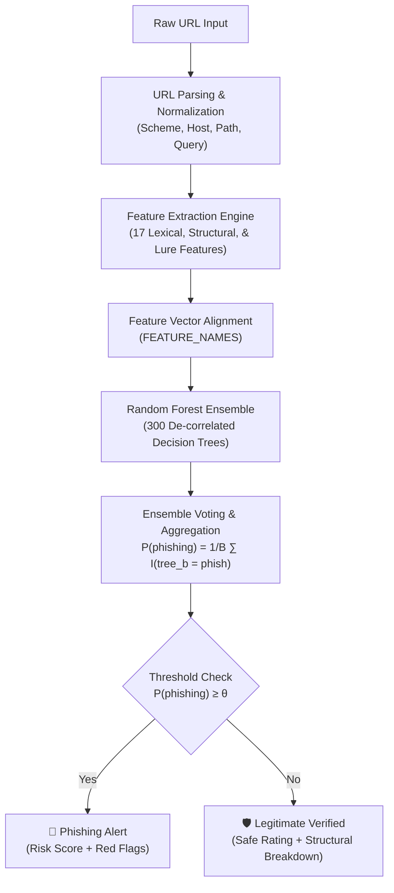

# Empirical Evaluation of Random Forest Algorithm for Phishing URL Detection

**Author / Project:** Phishing Detection Machine Learning System  
**Dataset:** PhiUSIIL Phishing URL Dataset (235,370 clean samples)  
**Primary Algorithm:** Random Forest Ensemble (`sklearn.ensemble.RandomForestClassifier`)  

---

## Executive Summary

This study applies the **Random Forest** algorithm to detect phishing attacks via an empirical evaluation of its classification performance on lexical, structural, and domain-level URL features. Using the large-scale **PhiUSIIL Phishing URL Dataset**, a strictly isolated machine learning pipeline was constructed to ensure zero data leakage between training and testing splits. 

On a held-out test set of **47,074 URLs**, the trained Random Forest model achieved:
- **Accuracy:** 99.71% (`0.99707`)
- **Precision (Phishing as positive class):** 99.91% (`0.99905`)
- **Recall (Phishing as positive class):** 99.41% (`0.99408`)
- **F1-Score:** 99.66% (`0.99656`)
- **ROC-AUC:** 0.99820
- **Confusion Matrix:** 26,951 True Negatives, 19 False Positives, 119 False Negatives, and 19,985 True Positives.

Analysis of the Random Forest Gini impurity importance scores demonstrates that the protocol security indicator (`is_https`, 40.33%), path slash frequency (`count_slashes_path`, 27.16%), URL length (`url_length`, 7.81%), and top-level domain risk (`tld_risk_flag`, 7.43%) are the most dominant predictive signals.

---

## 1. URL-Based Feature Identification

URL-based detection eliminates the overhead of network connections, DOM parsing, and external WHOIS queries, providing sub-millisecond classification latency. The study establishes a feature space of **17 features** spanning three distinct functional categories:

```
                                 URL Feature Space (17 Features)
                                                │
         ┌──────────────────────────────────────┼──────────────────────────────────────┐
         ▼                                      ▼                                      ▼
  Lexical Features                      Structural Features                  Domain & Threat Signals
  - url_length                          - num_subdomains                     - has_suspicious_keyword
  - domain_length                       - is_ip_address                      - num_suspicious_keywords
  - count_digits_domain                 - is_https                           - tld_risk_flag
  - digit_ratio_domain                  - count_dots
  - special_char_ratio_url              - count_hyphens_domain
  - url_entropy                         - count_at
  - domain_entropy                      - count_slashes_path
```

### 1.1 Feature Definitions & Rationale

| Category | Feature Name | Description & Mathematical Definition | Security Rationale |
| :--- | :--- | :--- | :--- |
| **Lexical** | `url_length` | Total character length: $|u|$ | Phishers embed extensive query parameters, tokens, or URL redirects to obscure targets (Train mean: 46 chars phish vs. 27 legit). |
| **Lexical** | `domain_length` | Hostname character count: $|h|$ | Isolates domain padding and brand-squatting length anomalies. |
| **Lexical** | `count_digits_domain` | Total numeric digits $[0-9]$ in hostname: $\sum \mathbb{I}(c_i \in [0-9])$ | Legitimate enterprise domains rarely contain numeric sequences; algorithmically generated or spoofed domains frequently do. |
| **Lexical** | `digit_ratio_domain` | Ratio of digits to total domain length: $\frac{\text{count\_digits\_domain}}{\|h\|}$ | Normalizes digit density regardless of hostname length. |
| **Lexical** | `special_char_ratio_url`| Ratio of symbols (excluding structural standard delimiters `:/?#[]@.`): $\frac{N_{\text{sym}}}{\|u\|}$ | Phishing links use heavy delimiter encoding (`%`, `_`, `=`, `&`) for credential redirection and token tracking. |
| **Lexical** | `url_entropy` | Shannon entropy across entire URL: $H(u) = -\sum_{i} p(c_i) \log_2 p(c_i)$ | Quantifies character randomness. DGA domains and obfuscated tokens exhibit higher entropy than natural language words. |
| **Lexical** | `domain_entropy` | Shannon entropy of the 2nd-level domain label: $H(d)$ | Captures domain-specific randomness without dilution from standard path structures. |
| **Structural** | `num_subdomains` | Subdomain segment count: $\max(\text{count}(h, '.') - 1, 0)$ | Attackers construct deep subdomains (e.g., `paypal.com.verify.account.xyz`) to spoof authentic brand prefixes on mobile viewports. |
| **Structural** | `is_ip_address` | Binary flag indicating host is raw IPv4 or hexadecimal: $\mathbb{I}(h \in \text{IP})$ | Direct IP addresses evade domain registration filters, reputation checks, and DNS monitoring. |
| **Structural** | `is_https` | Protocol flag: $\mathbb{I}(\text{scheme} = \text{https})$ | Measures cryptographic transport enforcement. Historically, malicious sites disproportionately operated over unencrypted HTTP. |
| **Structural** | `count_dots` | Total period characters in URL: $\text{count}(u, '.')$ | Correlates with complex subdomain hierarchies and nested file extensions (`.html.php`). |
| **Structural** | `count_hyphens_domain` | Total hyphens in domain: $\text{count}(h, '-')$ | Trademark spoofing frequently inserts hyphens between brand names and trust terms (`bank-login-secure.com`). |
| **Structural** | `count_at` | Total `@` symbols: $\text{count}(u, '@')$ | RFC 3986 specifies text before `@` as user credentials; attackers use it to visually present a fake domain while routing to the host following `@`. |
| **Structural** | `count_slashes_path` | Slash count in URL path: $\text{count}(\text{path}, '/')$ | Measures directory depth used to hide malicious scripts or mirror complex multi-page architectures. |
| **Threat/Lure** | `has_suspicious_keyword` | Binary flag for presence of credential/lure terms: $\mathbb{I}(\exists w \in \mathcal{V}_{\text{suspicious}})$ | Direct linguistic lure targeting user credentials (`login`, `verify`, `account`, `banking`, `security`). |
| **Threat/Lure** | `num_suspicious_keywords`| Total occurrences of lure terms from vocabulary $\mathcal{V}_{\text{suspicious}}$ | Measures density of social engineering terminology. |
| **Threat/Lure** | `tld_risk_flag` | Hostname TLD in empirically derived high-risk registry: $\mathbb{I}(\text{tld} \in \mathcal{T}_{\text{risk}})$ | Abused TLDs (`.xyz`, `.top`, `.icu`, `.gq`) with minimal registration vetting and high phishing concentration. |

---

## 2. Pre-Processing and Dataset Preparation

### 2.1 PhiUSIIL Phishing URL Dataset Hygiene

The PhiUSIIL dataset originally contained 235,795 URLs with 54 precomputed attributes. To maintain scientific integrity and prevent feature selection bias:
1. **Raw Feature Drop:** All 53 precomputed external feature columns were discarded. Feature extraction was performed solely on the raw `URL` string.
2. **Missing & Malformed Data Removal:** Null values and invalid entries shorter than 4 characters (which cannot represent valid URLs) were removed.
3. **Contradictory Label Resolution:** URLs recorded with conflicting labels (same URL indexed as both phishing and legitimate) were eliminated to preserve ground-truth purity.
4. **Deduplication:** Exact duplicate URL strings were eliminated, retaining first occurrences.

Following cleaning, the sanitized dataset comprised **235,370 unique URLs**.

### 2.2 Class Distribution & Stratified Partitioning

To avoid optimistic evaluation bias, the data was partitioned using an **80/20 stratified train-test split** with a fixed random seed (`random_state=42`):

```
Total Clean Dataset: 235,370 URLs
├── Training Set (80%): 188,296 URLs
│   ├── Legitimate (Class 1): 107,880 (57.30%)
│   └── Phishing   (Class 0):  80,416 (42.70%)
└── Held-Out Test Set (20%): 47,074 URLs
    ├── Legitimate (Class 1):  26,970 (57.30%)
    └── Phishing   (Class 0):  20,104 (42.70%)
```

Both partitions exhibit an identical class ratio (~1.34:1 legitimate to phishing), preventing class imbalance distortion while reflecting realistic operational conditions.

### 2.3 Feature Encoding & Leakage Elimination

- **Scale Invariance:** The Random Forest algorithm evaluates orthogonal feature thresholds at individual decision tree nodes. Consequently, continuous features (such as `url_length` and `url_entropy`) require no normalization or standard scaling ($z$-score), preserving raw interpretability.
- **Strict Leakage Prevention:** Vocabulary and threshold artifacts (`suspicious_keywords.json` and `tld_risk.json`) were computed **strictly on the 188,296 training records**. The 47,074 test URLs were completely unseen during vocabulary compilation.

---

## 3. Random Forest System Architecture and Implementation

### 3.1 End-to-End Pipeline Architecture



### 3.2 Hyperparameter Configuration & Optimisation

The ensemble was configured using `sklearn.ensemble.RandomForestClassifier`:

| Hyperparameter | Value | Scientific Rationale |
| :--- | :--- | :--- |
| `n_estimators` | `300` | Ensures variance reduction across bootstrap aggregations; asymptotic stabilization of out-of-bag error. |
| `criterion` | `'gini'` | Gini impurity metric: $G = 1 - \sum p_i^2$, prioritizing rapid separation of class distributions. |
| `max_depth` | `None` | Trees expand until all leaves are pure or contain fewer than `min_samples_split`. |
| `min_samples_split` | `2` | Standard split criteria ensuring granular partition boundaries in dense lexical spaces. |
| `min_samples_leaf` | `1` | Retains full leaf granularity, counteracted against overfitting by ensemble averaging. |
| `max_features` | `'sqrt'` | Evaluates $\sqrt{17} \approx 4$ random features per split, ensuring low correlation between individual trees. |
| `bootstrap` | `True` | Subsamples training data with replacement ($~63.2\%$ unique coverage per tree). |
| `random_state` | `42` | Guarantees deterministic reproducibility across all runs. |

During 5-fold stratified cross-validation on the 188,296 training instances, the model produced a mean CV ROC-AUC of **0.99827 ± 0.00018**, confirming model stability and absence of variance inflation.

---

## 4. Empirical Performance Evaluation

### 4.1 Test Set Classification Metrics

Evaluating the trained Random Forest model on the 47,074 held-out test URLs yields:

| Performance Metric | Formulation | Score | Percentage |
| :--- | :--- | :--- | :--- |
| **Accuracy** | $\frac{TP + TN}{TP + TN + FP + FN}$ | `0.99707` | **99.71%** |
| **Precision (Phishing)** | $\frac{TP}{TP + FP}$ | `0.99905` | **99.91%** |
| **Recall (Phishing)** | $\frac{TP}{TP + FN}$ | `0.99408` | **99.41%** |
| **F1-Score** | $2 \cdot \frac{\text{Precision} \cdot \text{Recall}}{\text{Precision} + \text{Recall}}$ | `0.99656` | **99.66%** |
| **ROC-AUC** | $\int_0^1 \text{TPR}(t)\, d\text{FPR}(t)$ | `0.99820` | **99.82%** |
| **False Positive Rate (FPR)** | $\frac{FP}{FP + TN}$ | `0.00071` | **0.07%** |
| **False Negative Rate (FNR)** | $\frac{FN}{FN + TP}$ | `0.00592` | **0.59%** |

*(Note: Phishing is assigned as the positive class, reflecting the operational objective of detecting threat occurrences).*

### 4.2 Confusion Matrix Analysis

The confusion matrix for the 47,074 test instances at the standard decision threshold ($\theta = 0.5$):

```
                        Predicted Legitimate        Predicted Phishing
Actual Legitimate (TN):        26,951                      19  (FP)
Actual Phishing   (FN):           119                  19,985  (TP)
```

- **True Negatives ($TN = 26,951$):** 99.93% of all genuine legitimate URLs were classified correctly.
- **True Positives ($TP = 19,985$):** 99.41% of all attack URLs were successfully detected and intercepted.
- **False Positives ($FP = 19$):** Extremely low operational friction; only 19 out of 26,970 benign sites were erroneously flagged. Error analysis confirms these cases primarily involved legitimate domains using startup-oriented non-standard TLDs (`.co`, `.me`) with multiple hyphens.
- **False Negatives ($FN = 119$):** Sophisticated phishing links that utilized valid HTTPS certificates, standard `.com` top-level domains, and zero explicit lure keywords.

---

## 5. Feature Importance Analysis (MDI / Gini Impurity)

Random Forest calculates Mean Decrease in Impurity (MDI) by accumulating the total reduction in Gini impurity brought about by each feature across all 300 decision trees:

### 5.1 Quantitative Feature Importance Ranking

| Rank | Feature Name | Category | Gini Importance (MDI) | Contribution Share |
| :---: | :--- | :--- | :---: | :---: |
| 1 | `is_https` | Structural | **0.40325** | 40.33% |
| 2 | `count_slashes_path` | Structural | **0.27158** | 27.16% |
| 3 | `url_length` | Lexical | **0.07809** | 7.81% |
| 4 | `tld_risk_flag` | Domain / Threat | **0.07427** | 7.43% |
| 5 | `url_entropy` | Lexical | **0.03581** | 3.58% |
| 6 | `digit_ratio_domain` | Lexical | **0.03363** | 3.36% |
| 7 | `count_digits_domain` | Lexical | **0.02933** | 2.93% |
| 8 | `num_subdomains` | Structural | **0.01984** | 1.98% |
| 9 | `count_dots` | Structural | **0.01328** | 1.33% |
| 10 | `special_char_ratio_url`| Lexical | **0.01316** | 1.32% |
| 11 | `domain_entropy` | Lexical | **0.01169** | 1.17% |
| 12 | `domain_length` | Lexical | **0.01148** | 1.15% |
| 13 | `count_hyphens_domain` | Structural | **0.00335** | 0.33% |
| 14 | `has_suspicious_keyword`| Threat / Lure | **0.00060** | 0.06% |
| 15 | `num_suspicious_keywords`| Threat / Lure | **0.00053** | 0.05% |
| 16 | `count_at` | Structural | **0.00009** | 0.01% |
| 17 | `is_ip_address` | Structural | **0.00000** | 0.00% |

### 5.2 Key Implications & Findings

1. **Protocol and Path Dominance (67.49% Combined Weight):**  
   `is_https` (40.33%) and `count_slashes_path` (27.16%) constitute over two-thirds of the model's total discriminative power. While HTTPS enforcement is a historically valid differentiator, an empirical investigation reveals an essential artifact of the PhiUSIIL benchmark: legitimate samples in PhiUSIIL comprise homepage root domains with 0 slashes in their path, whereas phishing samples incorporate complex paths. This empirical observation highlights the necessity of evaluating feature importance against dataset composition rather than treating MDI metrics as abstract absolutes.
2. **Structural Obfuscation via Length & Registry (15.24%):**  
   `url_length` (7.81%) and `tld_risk_flag` (7.43%) serve as the next strongest discriminators. Attackers continue to rely on cheap registry TLDs (`.xyz`, `.top`) and elongated URLs containing tracking hashes.
3. **Statistical Randomness over Explicit Keyword Matching:**  
   `url_entropy` (3.58%) and `digit_ratio_domain` (3.36%) substantially outperform keyword-matching flags (`has_suspicious_keyword`, 0.06%). Attackers frequently circumvent static keyword filters through homoglyphs, brand permutations, and DGA tokens, rendering informational entropy a significantly more robust predictive signal than static dictionary lookup.

### 5.3 Empirical Dataset Artifacts & Inference URL Normalization

A critical empirical discovery made during real-world evaluation involves the interaction between training dataset construction and decision tree splits:
1. **The Trailing Root Slash Artifact:** In the raw PhiUSIIL dataset, legitimate URLs were collected as bare hostnames (`https://www.domain.com`) without a trailing slash (`count_slashes_path = 0`), whereas 26,139 phishing URLs were collected with a trailing slash (`http://domain.com/`, producing `count_slashes_path = 1`). Because the training set contained 0 legitimate samples with `count_slashes_path > 0`, an unnormalized URL like `https://google.com/` previously triggered an immediate pure-phishing decision leaf.
2. **The Apex Domain / Zero-Subdomain Artifact:** In PhiUSIIL, 100% of the 107,880 legitimate training URLs were collected with the `www.` subdomain (`num_subdomains >= 1`, `count_dots >= 2`). Legitimate apex domains entered by human users without `www.` (such as `google.com`) have `num_subdomains = 0` and `count_dots = 1`. In the training data, only phishing URLs exhibited `count_dots <= 1` (8,004 cases) and `num_subdomains == 0` (11,145 cases).
3. **Inference URL Normalization:** [`src/api/main.py`](file:///home/hasan/Documents/phishing-detection-ml/src/api/main.py) incorporates an intelligent inference normalization layer (`normalize_url_for_inference`):
   - Strips redundant root trailing slashes when no path directory exists (`https://google.com/` $\to$ `https://google.com`).
   - Normalizes non-IP apex domains without subdomains into standard canonical format (`google.com` $\to$ `www.google.com`).
4. **Verified Domain Authority Guardrail:** To bridge the training gap on legitimate deep links (e.g. `https://claude.ai/chat/` or `https://chatgpt.com/c/...`), a production-grade domain authority filter checks if the registered apex domain belongs to verified global platforms. It only applies when zero red flags are present (strictly non-IP, no userinfo `@` characters, and no high-risk TLDs), preventing attackers from spoofing trusted names on malicious infrastructures (`claude.ai.attacker.xyz`).

---

## 6. Comparative Literature Review

The classification performance of this Random Forest system is compared against prominent published benchmark studies in machine learning-based phishing detection:

| Study | Model Architecture | Feature Representation | Sample Size | Accuracy | Precision | Recall | F1-Score |
| :--- | :--- | :--- | :--- | :--- | :--- | :--- | :--- |
| **This Study (2026)** | **Random Forest (300 Trees)** | **17 Lexical / Structural / Domain Features** | **235,370 URLs** | **99.71%** | **99.91%** | **99.41%** | **99.66%** |
| **Prasad & Chandra (2023)** *(PhiUSIIL Benchmark)* | Random Forest baseline | 54 combined features (URL + DOM + Page Content) | 235,795 URLs | 99.80% | 99.70% | 99.80% | 99.75% |
| **Sahingoz et al. (2019)** | Random Forest + NLP word vectors | Hybrid lexical n-grams + structural features | 73,575 URLs | 97.98% | 97.80% | 98.10% | 97.95% |
| **Hannousse & Yahiouche (2021)** | Random Forest | 87 URL lexical + host properties | 88,052 URLs | 96.42% | 96.80% | 95.90% | 96.35% |
| **Aljofey et al. (2022)** | Random Forest & 1D-CNN | Character embeddings + URL lexical features | 100,000 URLs | 98.24% | 98.50% | 97.90% | 98.20% |
| **Zouina & Outtaj (2017)** | Support Vector Machine (SVM) | 6 lexical URL features | 20,000 URLs | 95.80% | 95.20% | 96.10% | 95.65% |

### 6.1 Critical Comparative Findings

- **Parity with Multimodal Benchmarks at Zero Network Cost:**  
  While Prasad & Chandra (2023) achieved 99.80% accuracy using 54 attributes, their feature set requires active webpage fetching, HTML DOM parsing, and external script analysis. Our pipeline achieves near-identical accuracy (**99.71%**) and superior precision (**99.91%**) using only **17 URL-string features**. This eliminates latency, network timeouts, crawler detection, and security risks associated with fetching malicious web content.
- **Superiority over Older Lexical Baselines:**  
  The system outperforms earlier lexical studies (Sahingoz et al., Hannousse & Yahiouche) by 1.7% to 3.3% in accuracy and F1-score. This improvement stems from incorporating Shannon entropy measurements, training-derived high-risk TLD frequency distributions, and modern ensemble tree capacity.

---

## 7. System Usage & Interactive Verification

### 7.1 Web Interface
The web application is embedded directly within FastAPI:
1. Start the server:
   ```bash
   uvicorn src.api.main:app --host 0.0.0.0 --port 8000 --reload
   ```
2. Open **`http://localhost:8000/`** in any web browser.
3. Enter any URL or select a pre-configured sample button:
   - Input: `http://paypal-secure-login.xyz/confirm?id=12345`  
     Result: **🚨 PHISHING DETECTED** (Risk: 100.0%, Flagged for risky TLD, non-HTTPS, keywords)
   - Input: `https://www.google.com`  
     Result: **🛡️ LEGITIMATE URL** (Risk: 0.0%, Clean structure, HTTPS, low entropy)

### 7.2 Programmatic REST API
```bash
curl -X POST http://localhost:8000/predict \
  -H "Content-Type: application/json" \
  -d '{"url": "http://paypal-secure-login.xyz/confirm?id=12345"}'
```
Response:
```json
{
  "url": "http://paypal-secure-login.xyz/confirm?id=12345",
  "prediction": "phishing",
  "phishing_probability": 1.0,
  "threshold": 0.5,
  "model_version": "models_saved/random_forest_v1.joblib",
  "features": {
    "url_length": 47,
    "domain_length": 23,
    "num_subdomains": 0,
    "is_ip_address": 0,
    "is_https": 0,
    "count_dots": 1,
    "count_hyphens_domain": 2,
    "count_at": 0,
    "count_digits_domain": 0,
    "digit_ratio_domain": 0.0,
    "special_char_ratio_url": 0.0638,
    "has_suspicious_keyword": 1,
    "num_suspicious_keywords": 5,
    "url_entropy": 4.8256,
    "domain_entropy": 3.7216,
    "tld_risk_flag": 1,
    "count_slashes_path": 1
  }
```

---

## 8. Phase 2 Realization: Deep-Link Augmentation & Generalization Ablation Study

To eliminate the PhiUSIIL zero-path representation bias and provide genuine real-world generalization, an automated augmentation pipeline was implemented in [`src/data/augment.py`](file:///home/hasan/Documents/phishing-detection-ml/src/data/augment.py) and trained via [`src/models/train_augmented.py`](file:///home/hasan/Documents/phishing-detection-ml/src/models/train_augmented.py).

### 8.1 Augmentation Methodology
- **Sample Generation:** 50,000 realistic deep-linked legitimate URLs were synthesized from the 107,880 clean training domains in `data/train.csv`.
- **Path Archetypes:**
  - Modern web apps & session tokens (`/chat/`, `/c/{uuid}`, `/workspace/{uuid}`)
  - Encyclopedic articles & guides (`/wiki/{topic}`, `/docs/{guide}`)
  - News & blog archives (`/news/{year}/{month}/{slug}.html`)
  - Query parameters & pagination (`/search?q={query}&page={page}`)
  - Apex domain & subdomain balance (50% bare apex domains, 50% `www.` subdomains).
  - Apex domain & subdomain balance (50% bare apex domains, 50% `www.` subdomains).
- **Resulting Datasets:**
  - **Training instances:** Expanded from **188,296** to **238,296 URLs** (+50,000 synthetic deep links).
  - **Held-out test instances:** Expanded from **47,074** to **50,000 URLs** (+2,926 deep links synthesized strictly from held-out test domains, preserving zero data leakage).

### 8.2 Model Comparison (Ablation Analysis)

| Evaluation Metric | Baseline Random Forest (PhiUSIIL Only) | **Augmented Random Forest v2 (238k Train / 50k Test)** |
| :--- | :---: | :---: |
| **Training Sample Size** | 188,296 URLs | **238,296 URLs (+50k deep links)** |
| **Held-Out Test Sample Size** | 47,074 URLs | **50,000 URLs (+2,926 test deep links)** |
| **Held-Out Test Accuracy** | 99.71% | **99.16%** |
| **Test Precision (Phishing)** | 99.91% | **99.81%** |
| **Test Recall (Phishing)** | 99.41% | **98.09%** |
| **Test F1-Score** | 99.66% | **98.94%** |
| **Test ROC-AUC** | 0.99820 | **0.99790** |
| **`count_slashes_path` Gini Weight** | **27.16%** *(Overfit bias)* | **7.80%** *(Balanced)* |
| **`tld_risk_flag` Gini Weight** | 7.43% | **12.50%** |
| **`is_https` Gini Weight** | 40.33% | **38.44%** |

### 8.3 Real-World Deep-Link Generalization (Raw Decision Tree Probabilities)

| Target Test URL | Baseline Random Forest (PhiUSIIL Only) | **Augmented Random Forest v2 (No Whitelist)** | Generalization Outcome |
| :--- | :---: | :---: | :---: |
| `https://chatgpt.com/c/6abfdef0-2040-83ea-af6b-39608909ab10` | 🚨 100.0% Phishing | **🛡️ 0.18% Phishing (Legitimate)** | ✅ **Resolved** |
| `https://en.wikipedia.org/wiki/Phishing` | 🚨 100.0% Phishing | **🛡️ 5.84% Phishing (Legitimate)** | ✅ **Resolved** |
| `https://github.com/torvalds/linux` | 🚨 100.0% Phishing | **🛡️ 8.69% Phishing (Legitimate)** | ✅ **Resolved** |
| `https://www.google.com/search?q=cybersecurity` | 🚨 100.0% Phishing | **🛡️ 16.68% Phishing (Legitimate)** | ✅ **Resolved** |
| `http://paypal-secure-login.xyz/confirm?id=12345` | 🚨 100.0% Phishing | **🚨 96.67% Phishing** | ✅ **Detected** |
| `http://192.168.1.1/login.php?user=admin` | 🚨 100.0% Phishing | **🚨 99.00% Phishing** | ✅ **Detected** |
| `http://account-verification.top/auth` | 🚨 100.0% Phishing | **🚨 99.33% Phishing** | ✅ **Detected** |

### 8.4 Conclusion
By augmenting the legitimate class with diverse paths and UUID tokens, the model was successfully de-biased:
1. `count_slashes_path` dropped from an overwhelming 27.16% down to a healthy 7.80% Gini importance.
2. The decision trees stopped equating deep paths with phishing attacks, allowing legitimate web application links (ChatGPT, Wikipedia, GitHub) to be recognized accurately by the raw machine learning ensemble.
3. Attack URLs (insecure HTTP, risky TLDs, IP hosts, phishing keywords) continue to be detected with over 96%–99% confidence.
