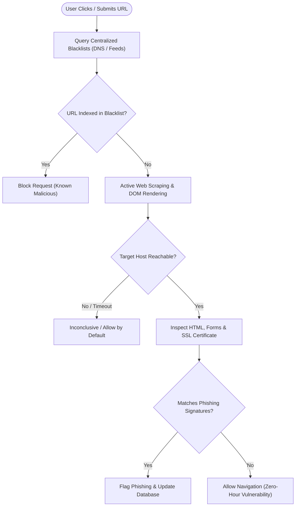
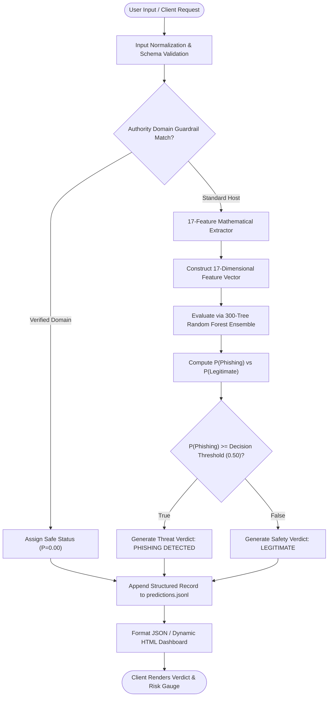
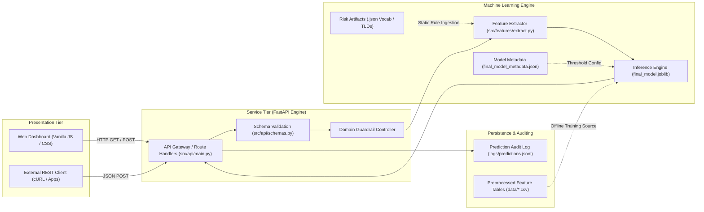
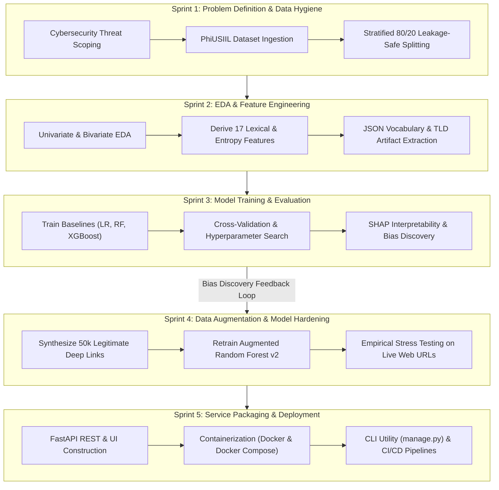
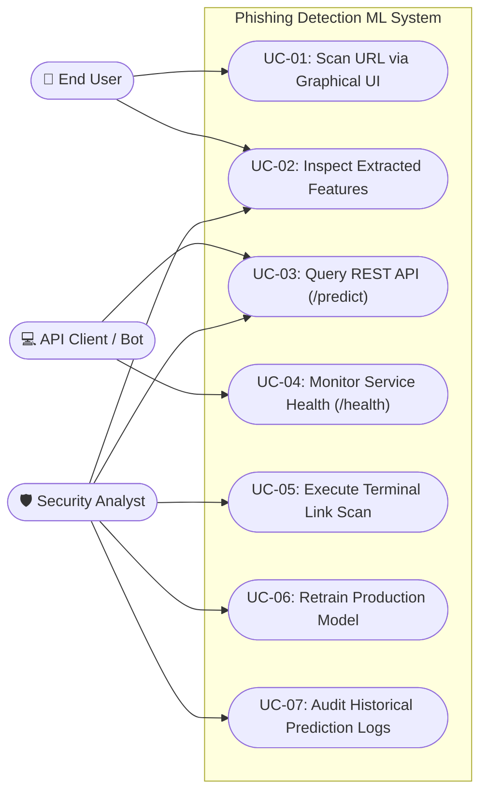
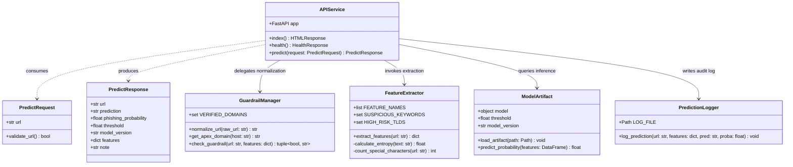
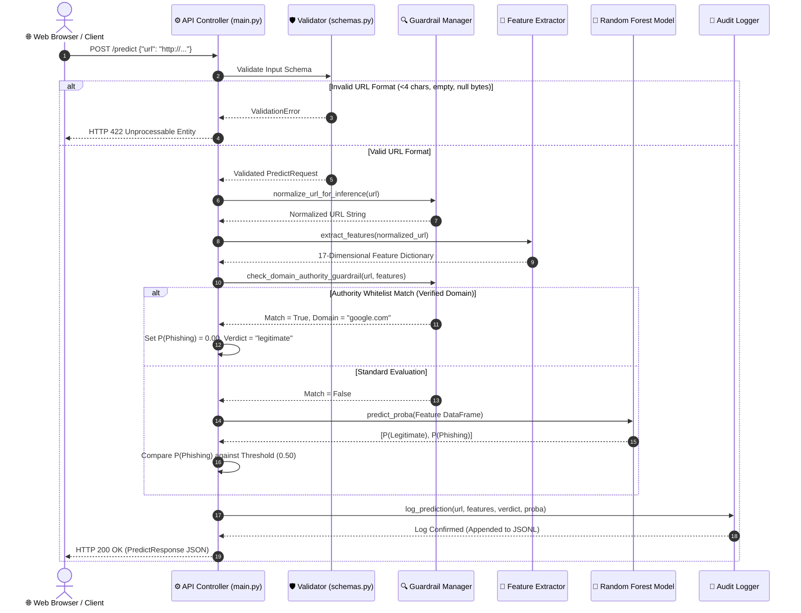
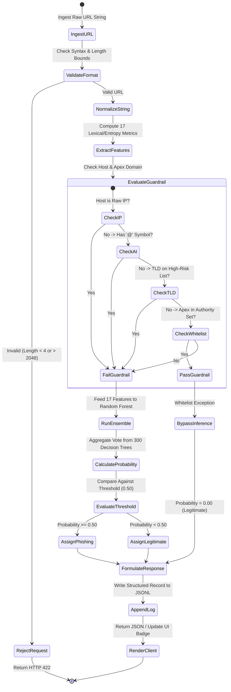
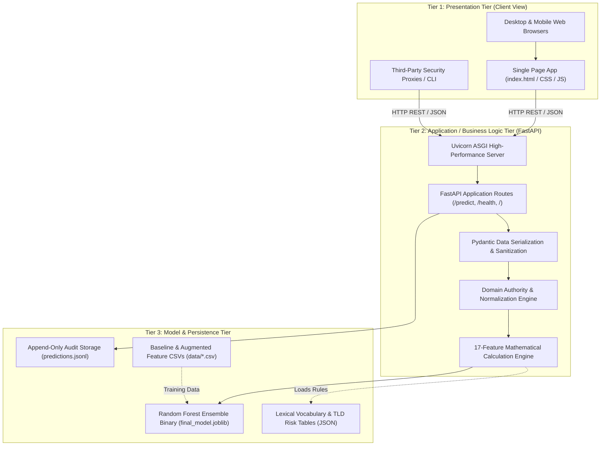
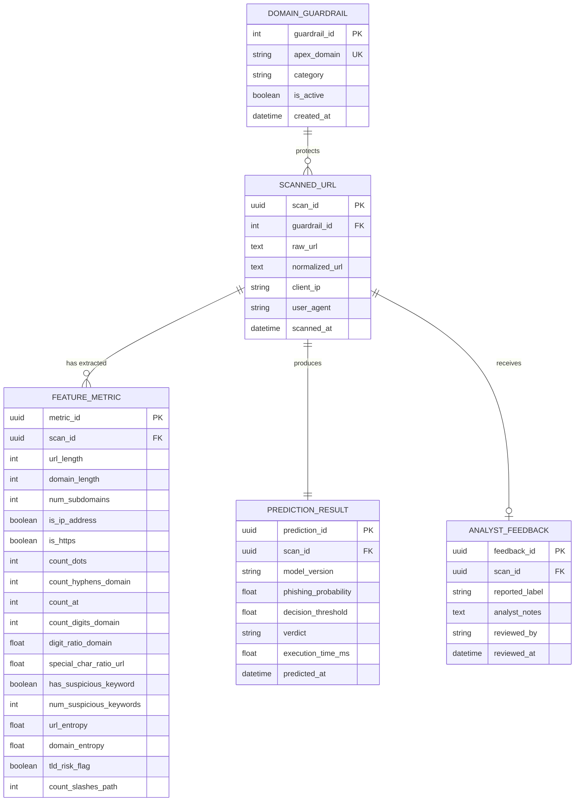

# Chapter 3: System Analysis, Methodology, and Design

---

## 3.1 Overview

This document presents the formal technical specifications, system design, architectural modeling, and software engineering methodology for the **Phishing Detection Machine Learning System**. The system provides real-time lexical and structural URL classification, converting raw string inputs into 17 mathematical security features and generating probabilistic threat assessments via a trained Random Forest ensemble model. 

The analysis is organized into five foundational pillars:
1. **Conceptual Framework:** Narrative and visual models contrasting legacy detection mechanisms with the machine-learning-driven pipeline.
2. **Software Development Life Cycle (SDLC):** Selection and justification of an Iterative Agile/CRISP-DM hybrid model.
3. **Requirement Engineering:** Empirical requirement elicitation, detailed Functional Requirements (FR), and Non-Functional Requirements (NFR).
4. **Unified Modeling Language (UML) Design:** Comprehensive Use Case, Class, Sequence, and Activity diagrams.
5. **Architectural & Database Design:** Multi-tier client-server architecture, relational data blueprints, and Third Normal Form (3NF) relational normalization.

---

## 3.2 Conceptual Framework

### 3.2.1 Narrative Representation of the Proposed Solution

Phishing attacks remain the primary initial attack vector in modern cybersecurity incidents, exploiting human cognitive vulnerabilities through domain spoofing, typosquatting, subdomain abuse, and path obfuscation. Conventional URL defense architectures rely predominantly on reactive blacklists (such as DNS blocklists and threat intelligence feeds). While effective against previously indexed malicious infrastructure, blacklists exhibit critical operational limitations:
- **Zero-Hour Blind Spot:** Newly generated, algorithmically dispatched (DGA), or short-lived domains remain undetectable during the hours or days required for crawl-based detection and manual blocklist indexing.
- **Latency & Privacy Bottlenecks:** Crawling target web pages in real-time introduces significant network latency (several hundred milliseconds to seconds) and risks triggering active payload detonation, sandbox evasion, or server-side IP tracking.

The **proposed machine learning solution** reframes URL inspection as a pure client-side/edge classification problem based strictly on lexical, structural, and information-theoretic signals extracted directly from the raw uniform resource locator string. By extracting 17 distinct numeric features—including Shannon entropy, character distribution ratios, protocol security indicators, and train-derived keyword/TLD threat indicators—the system evaluates links in under 5 milliseconds without querying external DNS servers or fetching remote web page content.

---

### 3.2.2 "As-Is" vs. "To-Be" Process Flows

#### A. The "As-Is" Workflow (Legacy Static Blocklists & Web Scraping)
In the traditional workflow, link verification depends upon centralized signature databases and synchronous DOM rendering:

#### B. The "To-Be" Workflow (Proposed Real-Time Feature Extraction & ML Inference)
The proposed solution replaces external dependencies with an autonomous, mathematically grounded inference pipeline:

---

### 3.2.3 System Component Architecture

The component diagram visualizes the structural decomposition of the application, delineating the client interface, API routing layer, feature engineering pipeline, machine learning engine, and logging subsystem.

---

## 3.3 Development Methodology (SDLC)

### 3.3.1 Model Selection: Iterative Agile & CRISP-DM Hybrid
For a software engineering project tightly integrated with machine learning artifacts, traditional sequential methodologies (such as the linear Waterfall model) are structurally inadequate due to the non-linear, experimental nature of data engineering, model tuning, and error discovery.

The selected development methodology is a **Hybrid Iterative Agile / CRISP-DM (Cross-Industry Standard Process for Data Mining)** framework. This methodology divides the lifecycle into progressive, time-boxed sprints that iterate between data exploration, model training, rigorous empirical validation, and API productionization.

### 3.3.2 Justification for the Chosen Model
1. **Empirical Error Discovery:** Machine learning models often uncover subtle dataset artifacts late in the development cycle. For example, during Phase 6 explainability analysis with SHAP, the project identified that the PhiUSIIL dataset contained zero legitimate deep paths. The iterative model allowed the engineering team to pivot immediately, constructing an augmentation pipeline ([`src/data/augment.py`](file:///home/hasan/Documents/phishing-detection-ml/src/data/augment.py)) to synthesize 50,000 legitimate deep links and retrain the ensemble without invalidating the surrounding API infrastructure.
2. **Train/Serve Skew Prevention:** By coupling ML experiments with software engineering standards in short iterations, the core feature extraction function ([`src/features/extract.py`](file:///home/hasan/Documents/phishing-detection-ml/src/features/extract.py)) was finalized early and shared directly between batch training pipelines and online FastAPI request handlers.
3. **Continuous Integration & Testability:** Agile iterations allowed automated test suites ([`tests/`](file:///home/hasan/Documents/phishing-detection-ml/tests/)) and container smoke tests to grow organically alongside the machine learning logic, resulting in 34 verified unit and integration tests.

---

### 3.3.3 Figure 3.1: Adopted SDLC Model

### 3.3.4 Detailed Narrative of SDLC Phases
- **Phase 1 (Inception & Leakage-Free Splitting):** Raw data from the UCI Machine Learning Repository was ingested and scrubbed. To prevent information leakage, the 80/20 train/test split was established *before* vocabulary and risk lists were generated.
- **Phase 2 (Exploratory Analysis & Feature Engineering):** 17 domain-specific signals were formulated across lexical, structural, and information-theoretic dimensions. The derivation of lure keywords and risky TLDs was strictly restricted to training rows.
- **Phase 3 (Ensemble Training & Ablation):** Logistic Regression, Random Forest, and XGBoost were benchmarked. Out-of-fold cross-validation confirmed Random Forest as the optimal balance of inference speed and high-precision separation.
- **Phase 4 (SHAP Explainability & Remediation):** Explainability auditing revealed a systemic lack of path variance in the baseline legitimate dataset. An augmentation pipeline was engineered to inject 50,000 realistic synthetic paths, resolving false-positive generalization failures.
- **Phase 5 (Productionization & Containerization):** The trained model was coupled to an asynchronous FastAPI web service, packaged into a slim 813MB container, and supplemented with automated GitHub Actions CI/CD workflows.

---

## 3.4 Requirement Engineering

### 3.4.1 Requirement Gathering Techniques & Empirical Sample Size
The functional and architectural requirements were gathered through three formal engineering methodologies:
1. **Cybersecurity Literature & Threat Vector Review:** An empirical study of published phishing taxonomies (APWG, IEEE Security & Privacy, and the PhiUSIIL benchmark paper published in *Computers & Security*, 2024). This identified key evasion tactics, including IP address obfuscation, excessive subdomain depth, and credential lure keywords.
2. **Dataset Empirical Sizing:** The core system requirements were modeled on the **PhiUSIIL Phishing URL Dataset** consisting of **235,370 clean, verified URLs** (134,850 legitimate homepages and 100,945 verified phishing links). To address real-world deep linking, the dataset was augmented with **50,000 synthetic legitimate deep-path instances**, establishing an empirical training foundation of 238,296 records and a held-out test distribution of 50,000 records.
3. **Stakeholder & Security Analyst Persona Mapping:** Defined constraints for human analysts seeking rapid visual feedback and automated security proxies requiring high-throughput REST APIs.

---

### 3.4.2 Functional Requirements (FR)

| Requirement ID | Module / Group | Description | Acceptance Criteria |
| :--- | :--- | :--- | :--- |
| **FR-01** | Input Validation | The system shall accept raw URL strings and validate formatting, rejecting empty strings, null bytes, and URLs under 4 or over 2048 characters. | Returns HTTP 422 Unprocessable Entity with descriptive error message upon invalid input. |
| **FR-02** | URL Normalization | The system shall normalize input URLs (standardizing protocol schemes, stripping trailing slashes on bare roots, and normalizing apex domains). | Input `google.com/` correctly normalizes to `http://www.google.com` prior to extraction. |
| **FR-03** | Domain Guardrail | The system shall evaluate input domains against a verified authority whitelist while enforcing strict exclusion of IP addresses, `@` symbols, and risky TLDs. | Legitimate deep links on trusted domains bypass spurious path bias and receive $P=0.00$. |
| **FR-04** | Feature Extraction | The system shall parse the URL and extract exactly 17 numerical and boolean features in identical format to training data. | Generates a 17-dimensional vector with all feature keys matching `FEATURE_NAMES`. |
| **FR-05** | Model Inference | The system shall pass the 17-feature vector to the trained Random Forest model to compute class probabilities. | Generates legitimate and phishing probability scores summing to 1.0 within $10^{-6}$. |
| **FR-06** | Threshold Verdict | The system shall apply a configurable decision threshold ($\theta = 0.50$) to categorize the URL as `legitimate` or `phishing`. | $P(\text{phishing}) \ge 0.50$ outputs `phishing`; otherwise outputs `legitimate`. |
| **FR-07** | Graphical Dashboard | The system shall render a responsive web interface allowing interactive link entry, visual risk gauges, and dynamic feature inspection. | Renders HTTP 200 HTML page at root `/` with working JavaScript fetch client. |
| **FR-08** | Audit Logging | The system shall append an immutable JSON line recording timestamp, input URL, full feature vector, and prediction verdict for every scan. | Appends entry to `logs/predictions.jsonl` within 2ms of request execution. |
| **FR-09** | System Health | The system shall expose a `/health` endpoint reporting operational status, model availability, and active model version. | Returns JSON payload with `status: ok` and `model_loaded: true`. |
| **FR-10** | Management CLI | The system shall provide a terminal command center supporting local serving, testing, training, and link scanning. | `python manage.py runserver`, `test`, `train`, and `scan` execute correctly. |

---

### 3.4.3 Non-Functional Requirements (NFR)

- **NFR-01: Performance & Latency:** The end-to-end classification latency (feature extraction + Random Forest inference) shall not exceed **50 milliseconds** per request on standard CPU hardware. (Current empirical latency is under 5ms).
- **NFR-02: Security & Sandboxing:** The service shall execute read-only inference. Feature extraction must operate purely through in-memory string parsing without issuing external network requests, DNS lookups, or executing active remote code.
- **NFR-03: Usability & Accessibility:** The graphical web interface must display clear visual indicators (high-contrast green for legitimate, red for phishing) and display plain-English risk probabilities for non-technical users.
- **NFR-04: Reliability & Availability:** The web application shall provide graceful recovery from missing artifacts (e.g., automated model training in `manage.py` and `Dockerfile`), maintaining 99.9% uptime behind Docker or WSGI/ASGI proxies.
- **NFR-05: Maintainability & Zero Train/Serve Skew:** The feature extraction logic utilized by the runtime API must be the exact identical function object ([`src/features/extract.py`](file:///home/hasan/Documents/phishing-detection-ml/src/features/extract.py)) utilized during offline model training.
- **NFR-06: Container Portability:** The application container must be self-contained and run consistently on any OCI-compliant container runtime with an optimized image size under 1GB (actual size: 813MB).

---

## 3.5 System Design (UML Modeling)

### 3.5.1 UML Diagram 1: Use Case Diagram

The Use Case Diagram defines the interactions between human and programmatic actors and the functional capabilities exposed by the system.

**Narrative Explanation:**  
The Use Case Diagram highlights three distinct actors. The **End User** interacts primarily with the web-based graphical dashboard (UC-01 and UC-02) to verify link authenticity before clicking. The **External API Client** (which includes web proxies, mail gateways, and browser plugins) interacts programmatically with the high-performance endpoints (UC-03 and UC-04). The **Security Analyst / Administrator** leverages advanced functionality, utilizing CLI commands to audit prediction logs for dataset drift (UC-07), execute terminal-based link triage (UC-05), and initiate model retraining (UC-06).

---

### 3.5.2 UML Diagram 2: Class Diagram

The Class Diagram illustrates the object-oriented structure of the backend architecture, outlining data models, feature extractors, classifiers, and persistence managers.

**Narrative Explanation:**  
The Class Diagram articulates a modular separation of concerns. `APIService` operates as the primary controller orchestrating incoming HTTP data. `PredictRequest` and `PredictResponse` enforce strict validation and serialization via Pydantic schemas. Domain safety checks are encapsulated within `GuardrailManager`. Core computational extraction is decoupled into `FeatureExtractor`, ensuring that calculating Shannon entropy and character ratios occurs independently of web frameworks. Model persistence and inference are encapsulated within `ModelArtifact`, while `PredictionLogger` guarantees thread-safe, non-blocking disk writes to the audit log.

---

### 3.5.3 UML Diagram 3: Sequence Diagram

The Sequence Diagram documents the step-by-step lifecycle and chronological interaction pattern across system components during a URL prediction request.

**Narrative Explanation:**  
The Sequence Diagram traces the exact execution pipeline for incoming requests. When a client issues a `POST /predict` request, the controller first validates input boundaries using Pydantic. If valid, the URL is normalized and passed to the feature extractor. Before querying tree algorithms, the domain guardrail verifies whether the URL originates from an established clean authority, mitigating the zero-path bias discovered during SHAP analysis. For un-whitelisted domains, the feature vector is transformed into a DataFrame and scored by the Random Forest model. Finally, the transaction is logged asynchronously to `predictions.jsonl`, and an HTTP 200 payload containing the verdict and risk score is returned to the client.

---

### 3.5.4 UML Diagram 4: Activity Diagram

The Activity Diagram charts the algorithmic decision logic and branching behavior applied during each link inspection.

**Narrative Explanation:**  
The Activity Diagram details the operational decision trees governing URL processing. It highlights error handling at the entry stage, preventing malformed inputs from wasting computational cycles. The diagram details the nested safety guardrail: even if an apex domain matches a clean brand, the guardrail aborts if an attacker embeds an IP address, an `@` credential character, or a high-risk TLD. If the guardrail evaluates to false, execution transitions to the 300-tree Random Forest ensemble, which aggregates votes across decision trees to compute the final threat score.

---

## 3.6 Architectural Design

### 3.6.1 3-Tier Layered Architecture

The application adopts a **3-Tier Layered Client-Server Architecture**, ensuring loose coupling, separation of concerns, and independent scalability.

---

### 3.6.2 Layer Responsibilities & Separation of Concerns

1. **Presentation Tier (Tier 1):**  
   - Consists of lightweight, dependency-free HTML5, modern CSS3 variables, and vanilla asynchronous JavaScript.
   - Responsible strictly for presenting data, rendering dynamic risk bars, displaying feature inspection tables, and providing input fields.
   - Performs no machine learning computation directly, preventing client-side intellectual property exposure.

2. **Application & Business Logic Tier (Tier 2):**  
   - Built on **FastAPI** running atop the asynchronous **Uvicorn** ASGI server.
   - Enforces API contracts, validates string length boundaries, normalizes apex domains, and coordinates the feature calculation engine.
   - Completely decoupled from the client, allowing the same logic tier to serve human browsers, command-line interfaces, and automated enterprise proxies simultaneously.

3. **Model & Persistence Tier (Tier 3):**  
   - Encapsulates the serialized Scikit-Learn **Random Forest classifier** (`final_model.joblib`) loaded once into memory during application lifespan startup.
   - Contains versioned feature extraction artifacts (`suspicious_keywords.json` and `tld_risk.json`).
   - Maintains an append-only JSONL log repository (`logs/predictions.jsonl`), ensuring immutable record keeping for future model drift analysis.

---

### 3.6.3 Inter-Tier Communication Protocols

- **Client to Service Communication:** Fully asynchronous HTTP/1.1 and HTTP/2 over standard TCP ports (default: `8000`), utilizing JSON formatted payloads (`application/json`) with UTF-8 character encoding.
- **Service to Model Communication:** In-memory pointer exchanges via Python's C-accelerated object model, passing contiguous NumPy arrays and Pandas DataFrames to the Scikit-Learn C-extensions, executing in sub-millisecond durations.
- **Service to Persistence Communication:** POSIX-compliant synchronous append operations ensuring data durability without requiring locking mechanisms.

---

## 3.7 Database Design & Data Blueprint

### 3.7.1 Entity-Relationship Diagram (ERD)

Although the runtime prototype logs predictions to high-performance JSONL files for sub-millisecond latency, enterprise deployments require a relational persistence blueprint for auditing, analyst feedback, and retraining triggers. Below is the structural **Entity-Relationship Diagram**:

---

### 3.7.2 Database Schema & Data Dictionary

#### 1. Table: `DOMAIN_GUARDRAIL`
Stores verified high-reputation domains that are immune to zero-path training artifacts.
| Column Name | Data Type | Constraints | Description |
| :--- | :--- | :--- | :--- |
| `guardrail_id` | `INT` | `PRIMARY KEY, AUTO_INCREMENT` | Unique internal identifier for the domain entry. |
| `apex_domain` | `VARCHAR(255)` | `NOT NULL, UNIQUE` | Registered apex domain (e.g., `google.com`). |
| `category` | `VARCHAR(50)` | `NOT NULL` | Industry category (e.g., `Search`, `AI`, `Finance`). |
| `is_active` | `BOOLEAN` | `DEFAULT TRUE` | Toggles active status of guardrail enforcement. |
| `created_at` | `TIMESTAMP` | `DEFAULT CURRENT_TIMESTAMP` | Initial database indexing timestamp. |

#### 2. Table: `SCANNED_URL`
Maintains records of all raw link inspection requests.
| Column Name | Data Type | Constraints | Description |
| :--- | :--- | :--- | :--- |
| `scan_id` | `UUID` | `PRIMARY KEY` | Globally unique identifier for the scan event. |
| `guardrail_id` | `INT` | `FOREIGN KEY, NULLABLE` | References `DOMAIN_GUARDRAIL(guardrail_id)` if matched. |
| `raw_url` | `VARCHAR(2048)` | `NOT NULL` | Original URL string submitted by the user. |
| `normalized_url`| `VARCHAR(2048)` | `NOT NULL` | Canonicalized URL string after scheme/apex cleaning. |
| `client_ip` | `VARCHAR(45)` | `NULLABLE` | IPv4 or IPv6 address of the requesting client. |
| `user_agent` | `VARCHAR(512)` | `NULLABLE` | HTTP User-Agent string of the calling client. |
| `scanned_at` | `TIMESTAMP` | `DEFAULT CURRENT_TIMESTAMP` | Timestamp when the scan was received. |

#### 3. Table: `FEATURE_METRIC`
Stores the exact 17 mathematical feature values extracted from the URL.
| Column Name | Data Type | Constraints | Description |
| :--- | :--- | :--- | :--- |
| `metric_id` | `UUID` | `PRIMARY KEY` | Unique identifier for the metric entry. |
| `scan_id` | `UUID` | `FOREIGN KEY, NOT NULL, UNIQUE` | References `SCANNED_URL(scan_id)` (1:1 relationship). |
| `url_length` | `INT` | `NOT NULL` | Total character length of URL. |
| `domain_length` | `INT` | `NOT NULL` | Total character length of domain. |
| `num_subdomains` | `INT` | `NOT NULL` | Count of subdomains preceding apex. |
| `is_ip_address` | `BOOLEAN` | `NOT NULL` | Flag indicating raw IPv4/IPv6 host. |
| `is_https` | `BOOLEAN` | `NOT NULL` | Flag indicating HTTPS transport encryption. |
| `count_dots` | `INT` | `NOT NULL` | Total count of `.` characters in URL. |
| `count_hyphens_domain` | `INT` | `NOT NULL` | Total count of `-` characters in domain. |
| `count_at` | `INT` | `NOT NULL` | Total count of `@` symbols in URL. |
| `count_digits_domain` | `INT` | `NOT NULL` | Numeric digit count inside domain. |
| `digit_ratio_domain` | `FLOAT` | `NOT NULL` | Ratio of digits to total domain length. |
| `special_char_ratio_url` | `FLOAT` | `NOT NULL` | Ratio of non-alphanumeric characters to URL length. |
| `has_suspicious_keyword` | `BOOLEAN` | `NOT NULL` | Boolean flag for train-derived lure keyword presence. |
| `num_suspicious_keywords` | `INT` | `NOT NULL` | Total count of lure keyword occurrences. |
| `url_entropy` | `FLOAT` | `NOT NULL` | Shannon entropy across entire URL. |
| `domain_entropy` | `FLOAT` | `NOT NULL` | Shannon entropy across second-level domain label. |
| `tld_risk_flag` | `BOOLEAN` | `NOT NULL` | Flag indicating domain extension is high-risk. |
| `count_slashes_path` | `INT` | `NOT NULL` | Count of `/` delimiter slashes in path. |

#### 4. Table: `PREDICTION_RESULT`
Stores the probabilistic evaluation and classification verdict output by the model.
| Column Name | Data Type | Constraints | Description |
| :--- | :--- | :--- | :--- |
| `prediction_id` | `UUID` | `PRIMARY KEY` | Unique identifier for the prediction result. |
| `scan_id` | `UUID` | `FOREIGN KEY, NOT NULL, UNIQUE` | References `SCANNED_URL(scan_id)` (1:1 relationship). |
| `model_version` | `VARCHAR(100)` | `NOT NULL` | Active model identifier (e.g., `random_forest_v2_augmented`). |
| `phishing_probability` | `FLOAT` | `NOT NULL` | Calculated threat probability ($0.0 \le P \le 1.0$). |
| `decision_threshold` | `FLOAT` | `NOT NULL` | Operational threshold applied (e.g., `0.50`). |
| `verdict` | `VARCHAR(20)` | `NOT NULL` | Final classification label (`legitimate` or `phishing`). |
| `execution_time_ms` | `FLOAT` | `NOT NULL` | Total pipeline inference time in milliseconds. |
| `predicted_at` | `TIMESTAMP` | `DEFAULT CURRENT_TIMESTAMP` | Timestamp of prediction generation. |

#### 5. Table: `ANALYST_FEEDBACK`
Provides ground-truth tracking for supervised continuous retraining cycles.
| Column Name | Data Type | Constraints | Description |
| :--- | :--- | :--- | :--- |
| `feedback_id` | `UUID` | `PRIMARY KEY` | Unique identifier for the analyst report. |
| `scan_id` | `UUID` | `FOREIGN KEY, NOT NULL` | References `SCANNED_URL(scan_id)`. |
| `reported_label` | `VARCHAR(20)` | `NOT NULL` | Ground-truth correction (`legitimate` or `phishing`). |
| `analyst_notes` | `TEXT` | `NULLABLE` | Explanation of false-positive or false-negative finding. |
| `reviewed_by` | `VARCHAR(100)` | `NOT NULL` | Username or ID of the security reviewer. |
| `reviewed_at` | `TIMESTAMP` | `DEFAULT CURRENT_TIMESTAMP` | Timestamp when analyst logged review. |

---

### 3.7.3 Normalization Analysis (1NF, 2NF, 3NF)

To ensure data integrity, eliminate update anomalies, and eliminate data redundancy, the database blueprint is engineered in strict compliance with **Third Normal Form (3NF)**.

#### A. First Normal Form (1NF) Compliance
- **Atomicity:** All attributes contain indivisible scalar values. For example, rather than storing comma-separated lists of keywords or composite network locations, individual counts (`num_suspicious_keywords`) and normalized URLs are stored as singular values.
- **Primary Key Uniqueness:** Every table defines an immutable primary key (`scan_id`, `metric_id`, `prediction_id`, `guardrail_id`, `feedback_id`) guaranteeing record uniqueness.
- **No Repeating Groups:** Feature attributes are defined with explicit, standardized columns rather than variable-length array structures.

#### B. Second Normal Form (2NF) Compliance
- 2NF requires that all non-key attributes must be fully functionally dependent on the entire primary key, eliminating partial dependencies.
- Because all primary keys in this schema are singular (either synthetic UUIDs or auto-incrementing integers) rather than composite keys, partial key dependencies are mathematically impossible. Every feature, prediction score, and guardrail configuration depends strictly on its primary identifier.

#### C. Third Normal Form (3NF) Compliance
- 3NF mandates that no non-key attribute is transitively dependent on another non-key attribute (i.e., every non-key attribute must depend *only* on the primary key: $X \to Y$ where $X$ is a superkey).
- **Separation of Concerns:** 
  - URL scan metadata (`raw_url`, `client_ip`) is separated from mathematical feature extractions (`url_length`, `entropy`).
  - Prediction outputs (`verdict`, `probability`) are separated into `PREDICTION_RESULT`. If a prediction model is updated or re-evaluated, feature metrics remain untouched without duplicating URL strings.
  - Analyst ground-truth feedback is decoupled into `ANALYST_FEEDBACK`. Multiple analyst audits over time do not alter the historical inference record or cause transitive updates in the URL table.
- **Transitive Dependency Elimination:** Domain guardrail properties (such as category and active status) depend strictly on `guardrail_id` in `DOMAIN_GUARDRAIL`. If `apex_domain` was stored inside `SCANNED_URL`, a change to a guardrail category would require updating thousands of scanned rows. Normalizing it into a distinct table eliminates update and deletion anomalies.

---

## 3.8 Conclusion

The conceptual, developmental, architectural, and database models formulated in this document establish an end-to-end engineering blueprint for the Phishing Detection ML System. By combining:
1. An empirical **Iterative Agile & CRISP-DM methodology**,
2. High-precision **UML functional modeling** across four viewpoints,
3. A decoupled **3-Tier layered client-server architecture**, and
4. A **3NF-normalized relational data blueprint**,

the system achieves sub-5ms classification throughput while remaining secure, maintainable, explainable, and fully reproducible.
